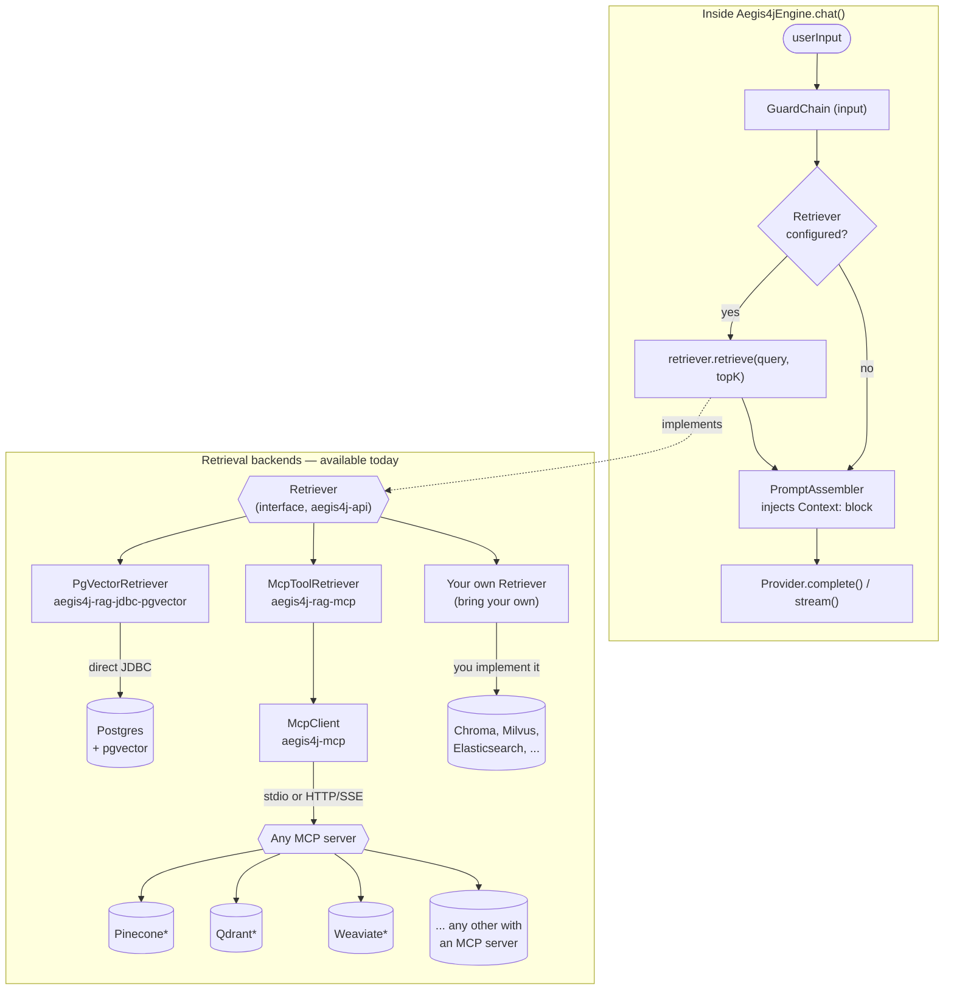

# Aegis4J

[](https://github.com/AndreLucasrs/aegis4j/actions/workflows/ci.yml)

[🇧🇷 Português](README.md) | 🇬🇧 English | [🇪🇸 Español](README.es.md)

A library for the JVM ecosystem (Java, Kotlin, Clojure, Scala) that sits in
front of LLMs, combining:

- **Provider abstraction** — swap LLM providers at runtime (Ollama,
  Anthropic, and any backend compatible with OpenAI's Chat Completions API —
  OpenAI itself, DeepSeek, Kimi/Moonshot, Groq, local servers, etc.) behind
  one common `Provider` interface.
- **Guardrails** — most run in plain code (regex, length limits, JSON Schema
  validation), no LLM call involved; one opt-in guard (`HallucinationGuard`)
  deliberately uses a second LLM as a grounding judge. Applied to both input
  and output.
- **Opt-in tool-calling** — a tool-execution loop wired into `chat()`, with
  the executor always supplied by whoever embeds the library (never
  automatic/unsafe by default).
- **Opt-in observability** — hooks (`EngineListener`) at every pipeline
  phase, with a ready-made OpenTelemetry-backed implementation.
- **Opt-in usage/cost tracking** — aggregates tokens per provider+model, with
  optional cost estimation from a configured pricing table.
- **Skills with progressive disclosure** — only name+description enter the
  prompt by default; a skill's full body only loads when it's activated.
- **Dual distribution** — usable as an embedded library (Gradle/Maven
  dependency) or as an HTTP sidecar (OpenAI-compatible request/response
  shape, including SSE streaming), so any language/CLI outside the JVM can
  use it too.
- **MCP client** (stdio + HTTP/SSE) — connects to any MCP (Model Context
  Protocol) server to expose external tools/resources.
- **Extensible RAG/retrieval** — a single `Retriever` interface (direct
  pgvector via JDBC, or any MCP server), plus a ready-made ingestion
  pipeline (loader → chunker → embed → pgvector).
- **Rule-based model routing** — programmatic (Java) or declarative (YAML)
  rules, whichever the library's user defines; first matching rule wins.

Current status: **v0.3** — see [Scope and limitations](#scope-and-limitations-v03)
at the bottom.

## Where to find things

| Capability | Section |
|---|---|
| Providers (Ollama, Anthropic, OpenAI-compatible) | [Connecting to each provider](#connecting-to-each-provider) |
| Guardrails (PII, length, prompt injection, JSON Schema, hallucination) | [Guardrails](#guardrails) |
| Skills with progressive disclosure | [Creating a declarative skill](#creating-a-declarative-skill) |
| Tool-calling (opt-in loop) | [Tool-calling](#tool-calling) |
| RAG/retrieval + document ingestion | [RAG/retrieval](#ragretrieval) ([ingestion](#document-ingestion)) |
| Model routing | [Model routing](#model-routing) |
| Observability/tracing | [Observability](#observability) |
| Usage/cost tracking | [Usage & cost tracking](#usage--cost-tracking) |
| MCP client | [MCP client](#mcp-client) |
| HTTP sidecar + SSE streaming | [Running the HTTP sidecar](#running-the-http-sidecar) |

## Requirements

- Java 17+ (the build toolchain targets Java 17 — any JVM 17 or newer runs
  the library; it does not work on Java 8/11)
- [Ollama](https://ollama.com) running locally (`http://localhost:11434`) if
  you want real responses instead of fake-backed tests.

No extra installation needed — the Gradle wrapper (`./gradlew`) is already in
the repository.

## Installing via JitPack

The code is published at [github.com/AndreLucasrs/aegis4j](https://github.com/AndreLucasrs/aegis4j)
and tag `v0.3.0` already builds on [JitPack](https://jitpack.io/#AndreLucasrs/aegis4j) — you can
add it as a dependency without building from source:

**Gradle** (`build.gradle.kts`):

```kotlin
repositories {
    maven { url = uri("https://jitpack.io") }
}

dependencies {
    implementation("com.github.AndreLucasrs.aegis4j:aegis4j-core:<tag>")
    implementation("com.github.AndreLucasrs.aegis4j:aegis4j-provider-ollama:<tag>")
    // any other module: aegis4j-provider-anthropic, aegis4j-provider-openai,
    // aegis4j-mcp, aegis4j-rag-jdbc-pgvector, aegis4j-rag-mcp, aegis4j-routing,
    // aegis4j-guardrails-builtin, aegis4j-observability-otel, ...
}
```

**Maven** (`pom.xml`):

```xml
<repositories>
    <repository>
        <id>jitpack.io</id>
        <url>https://jitpack.io</url>
    </repository>
</repositories>

<dependency>
    <groupId>com.github.AndreLucasrs.aegis4j</groupId>
    <artifactId>aegis4j-core</artifactId>
    <version>TAG</version>
</dependency>
```

`<tag>`/`TAG` is a GitHub release tag (e.g. `v0.2.0`) or a commit hash. The
`com.github.AndreLucasrs.aegis4j` groupId is JitPack's standard pattern for a
multi-module project (user.repository) — each module becomes its own
`artifactId`, so only declare the ones you actually use.

## Build and tests

```bash
./gradlew build
```

Compiles every module and runs the full test suite (guards, skills, the
Ollama provider against WireMock, and the server's acceptance test) — none of
it touches real network.

## Running the HTTP sidecar

```bash
./gradlew :aegis4j-server:run
```

Environment variables (all optional):

| Variable                     | Default                  | Description                                               |
|-------------------------------|---------------------------|----------------------------------------------------------|
| `AEGIS4J_PORT`                | `8686`                    | Sidecar's HTTP port                                       |
| `AEGIS4J_PROVIDER_ID`         | `ollama`                  | Active provider                                            |
| `AEGIS4J_OLLAMA_BASE_URL`     | `http://localhost:11434`  | Ollama base URL                                            |
| `AEGIS4J_MAX_INPUT_CHARS`     | `4000`                    | Input character ceiling (`MaxLengthGuard`)                 |
| `AEGIS4J_INJECTION_GUARDS`    | `on`                      | Prompt-injection guards (`PromptInjectionGuard` + `EncodedInjectionGuard`) on input and RAG chunks: `on`, `strict` (blocks any encoded text payload) or `off`. An invalid value stops the server from starting |
| `AEGIS4J_SERVER_API_KEY`      | *(none)*                  | Protects the server itself: when set, every request to non-`/health` endpoints needs an `Authorization: Bearer <key>` header, otherwise it gets `401`. When unset, the server stays open (default, backward-compatible behavior) |
| `AEGIS4J_SKILLS_DIR`          | *(none)*                  | Directory with declarative skills (`.md` + frontmatter)    |
| `AEGIS4J_RETRIEVER`           | *(none)*                  | `mcp` — enables retrieval via MCP (`pgvector` throws an explicit error in v0.2, see [limitations](#scope-and-limitations-v03)) |
| `AEGIS4J_MCP_RETRIEVER_TRANSPORT` | *(none)*              | `stdio` or `http`                                          |
| `AEGIS4J_MCP_RETRIEVER_COMMAND`   | *(none)*              | MCP server command, if transport is `stdio`                |
| `AEGIS4J_MCP_RETRIEVER_URL`       | *(none)*              | MCP server URL, if transport is `http`                     |
| `AEGIS4J_MCP_RETRIEVER_TOOL`      | `search`              | MCP tool name used for search                               |
| `AEGIS4J_ROUTING_CONFIG`      | *(none)*                  | Path to a `routing.yaml` — enables per-request `model` routing |
| `AEGIS4J_ANTHROPIC_API_KEY`   | *(none)*                  | API key — with `AEGIS4J_PROVIDER_ID=anthropic`, `AnthropicProvider` self-registers via `ServiceLoader` |
| `AEGIS4J_OPENAI_COMPATIBLE_ID`      | *(none)*            | Enables a generic `OpenAiCompatibleProvider` (e.g. `openai`, `deepseek`, `kimi`) — needs `_BASE_URL` too |
| `AEGIS4J_OPENAI_COMPATIBLE_BASE_URL`| *(none)*            | Base URL of the OpenAI-compatible backend                  |
| `AEGIS4J_OPENAI_COMPATIBLE_API_KEY` | *(none)*            | API key for that backend, if needed                          |

> **Default behavior change:** the server now blocks (HTTP 400) input matching prompt-injection patterns, including ones hidden in Base64, Morse, etc. To keep the previous behavior, set `AEGIS4J_INJECTION_GUARDS=off`.

Example with the sample skill (`aegis4j-server/src/main/resources/skills`)
loaded:

```bash
AEGIS4J_SKILLS_DIR="$PWD/aegis4j-server/src/main/resources/skills" \
  ./gradlew :aegis4j-server:run
```

Health check:

```bash
curl http://localhost:8686/health
```

### Chat completions (OpenAI-compatible shape)

```bash
curl -X POST http://localhost:8686/v1/chat/completions \
  -H "Content-Type: application/json" \
  -d '{
        "model": "qwen2.5-coder:7b",
        "messages": [
          {"role": "user", "content": "what is the weather like today?"}
        ]
      }'
```

Response:

```json
{
  "id": "ollama-...",
  "object": "chat.completion",
  "created": 1234567890,
  "model": "qwen2.5-coder:7b",
  "choices": [
    {"index": 0, "message": {"role": "assistant", "content": "..."}, "finish_reason": "stop"}
  ],
  "usage": {"prompt_tokens": 0, "completion_tokens": 0, "total_tokens": 0}
}
```

If the input or output contains an email, an API key, a valid credit card
(Luhn-checked) or an IPv4 address, `RegexPiiGuard` redacts it automatically
before continuing through the pipeline. An input longer than
`AEGIS4J_MAX_INPUT_CHARS` is blocked with HTTP 400.

**Streaming**: add `"stream": true` to get `chat.completion.chunk` events
over SSE, terminated by `data: [DONE]`:

```bash
curl -N -X POST http://localhost:8686/v1/chat/completions \
  -H "Content-Type: application/json" \
  -d '{
        "model": "qwen2.5-coder:7b",
        "messages": [{"role": "user", "content": "count to 3"}],
        "stream": true
      }'
```

```
data: {"id":"...","object":"chat.completion.chunk","created":...,"model":"qwen2.5-coder:7b","choices":[{"index":0,"delta":{"role":"assistant","content":""},"finish_reason":null}]}

data: {"id":"...","object":"chat.completion.chunk","created":...,"model":"qwen2.5-coder:7b","choices":[{"index":0,"delta":{"content":"1, 2, 3"},"finish_reason":null}]}

data: {"id":"...","object":"chat.completion.chunk","created":...,"model":"qwen2.5-coder:7b","choices":[{"index":0,"delta":{},"finish_reason":"stop"}]}

data: [DONE]
```

Output guards (`RegexPiiGuard`, etc.) **do not run** on streamed
responses — only in non-streaming `chat()`. Streaming also skips the
tool-calling loop (see [Tool-calling](#tool-calling)) and does not report
usage to a configured `UsageTracker` (`CompletionChunk` carries no `Usage`
yet).

## Using it as an embedded library (Java)

```java
ProviderRegistry providerRegistry = new ProviderRegistry();
providerRegistry.register(OllamaProvider.create());

SkillRegistry skillRegistry = SkillRegistry.inMemory();
new MarkdownSkillLoader().loadDirectory(Path.of("skills")).forEach(skillRegistry::register);

Aegis4jEngine engine = Aegis4jEngine.builder()
        .providerRegistry(providerRegistry)
        .guardChain(GuardChain.of(
                MaxLengthGuard.forInput(4000),
                RegexPiiGuard.allPatterns()
        ))
        .skillRegistry(skillRegistry)
        .build();

CompletionResponse response = engine.chat(ChatRequest.builder()
        .providerId(OllamaProvider.ID)
        .model("qwen2.5-coder:7b")
        .userInput("what is the weather like today?")
        .build());

System.out.println(response.content());
```

### Kotlin / Clojure / Scala

Since the core is pure Java, consuming it is plain JVM interop:

```kotlin
val engine = Aegis4jEngine.builder()
    .provider(OllamaProvider.create())
    .build()

val response = engine.chat(
    ChatRequest.builder()
        .providerId(OllamaProvider.ID)
        .model("qwen2.5-coder:7b")
        .userInput("what is the weather like today?")
        .build()
)
println(response.content())
```

```clojure
(import '[dev.aegis4j.core.engine Aegis4jEngine ChatRequest]
        '[dev.aegis4j.provider.ollama OllamaProvider])

(def engine (-> (Aegis4jEngine/builder)
                (.provider (OllamaProvider/create))
                (.build)))

(def request (-> (ChatRequest/builder)
                  (.providerId OllamaProvider/ID)
                  (.model "qwen2.5-coder:7b")
                  (.userInput "what is the weather like today?")
                  (.build)))

(println (.content (.chat engine request)))
```

## Connecting to each provider

They all implement the same `Provider` interface — swapping at runtime is
just registering one or another. Examples:

**Ollama** (local):

```java
providerRegistry.register(OllamaProvider.create()); // reads AEGIS4J_OLLAMA_BASE_URL, defaults to http://localhost:11434
```

**Anthropic**:

```java
providerRegistry.register(AnthropicProvider.create()); // reads AEGIS4J_ANTHROPIC_API_KEY
// or explicitly:
providerRegistry.register(new AnthropicProvider(
        "https://api.anthropic.com", "sk-ant-...", HttpClient.newHttpClient(), Duration.ofSeconds(60)
));

engine.chat(ChatRequest.builder()
        .providerId(AnthropicProvider.ID)
        .model("claude-sonnet-5")
        .userInput("explain what pgvector is")
        .build());
```

**OpenAI**:

```java
providerRegistry.register(OpenAiCompatibleProvider.openAi()); // reads AEGIS4J_OPENAI_API_KEY

engine.chat(ChatRequest.builder()
        .providerId("openai")
        .model("gpt-5")
        .userInput("explain what pgvector is")
        .build());
```

**DeepSeek** (OpenAI-compatible API):

```java
providerRegistry.register(OpenAiCompatibleProvider.deepSeek()); // reads AEGIS4J_DEEPSEEK_API_KEY

engine.chat(ChatRequest.builder()
        .providerId("deepseek")
        .model("deepseek-chat")
        .userInput("explain what pgvector is")
        .build());
```

**Kimi (Moonshot AI), Groq, Together AI, OpenRouter, a local server
(vLLM/LM Studio), or any other backend compatible with OpenAI's Chat
Completions API** — use `custom(...)` with that vendor's `id`, `baseUrl` and
`apiKey`. ⚠️ Double-check the exact base URL in that vendor's current docs —
it differs between vendors (some use a `/v1` prefix, some don't) and can
change over time:

```java
providerRegistry.register(OpenAiCompatibleProvider.custom(
        "kimi", "https://api.moonshot.ai/v1", System.getenv("AEGIS4J_KIMI_API_KEY")
));

engine.chat(ChatRequest.builder()
        .providerId("kimi")
        .model("kimi-latest")
        .userInput("explain what pgvector is")
        .build());
```

`baseUrl` must include everything up to (but not including)
`/chat/completions` — e.g. `https://api.openai.com/v1` for OpenAI,
`https://api.deepseek.com` for DeepSeek (no `/v1`).

### Circuit breaker / resilience

Aegis4J doesn't ship a circuit breaker — every `Provider`/`McpTransport`/
`PgVectorRetriever` only has an explicit per-call `Duration timeout`, which
already prevents hanging indefinitely on one call but doesn't prevent
retrying a service that's already known to be down. This is deliberate:
failure threshold, half-open timing, and what counts as a "failure" are
policy decisions that vary by deployment, and plenty of setups already run
Resilience4j, a service mesh, or load-balancer health checks — an internal
circuit breaker would just compete with that.

Since `Provider` is just an interface, you can wrap it with whatever you
already use, without touching the library. Example with
[Resilience4j](https://resilience4j.readme.io/):

```java
CircuitBreakerConfig config = CircuitBreakerConfig.custom()
        .failureRateThreshold(50)
        .waitDurationInOpenState(Duration.ofSeconds(30))
        .slidingWindowSize(10)
        .build();
CircuitBreaker circuitBreaker = CircuitBreaker.of("ollama", config);

Provider delegate = OllamaProvider.create();
Provider resilientProvider = new Provider() {
    @Override public String id() { return delegate.id(); }
    @Override public CompletionResponse complete(CompletionRequest request) {
        return circuitBreaker.executeSupplier(() -> delegate.complete(request));
    }
    @Override public Stream<CompletionChunk> stream(CompletionRequest request) {
        return circuitBreaker.executeSupplier(() -> delegate.stream(request));
    }
    @Override public List<ModelInfo> listModels() {
        return circuitBreaker.executeSupplier(delegate::listModels);
    }
};

providerRegistry.register(resilientProvider);
```

With the circuit open, `executeSupplier` throws `CallNotPermittedException`
(unchecked) — it propagates through `Aegis4jEngine.chat()` the same way a
`ProviderException` already does today, no special handling needed in the
engine. The same decorator pattern works for `Retriever` and `McpTransport`.

## Creating a declarative skill

Create a `.md` file with a YAML frontmatter block:

```markdown
---
name: weather-explainer
description: Explains weather concepts in simple, non-technical terms.
triggers: [weather, forecast, clima]
---
You are an expert meteorologist. Explain weather phenomena in plain language...
```

The name/description/triggers always enter the system prompt's catalog; the
body is only read from disk and injected when one of the `triggers` appears
in the user's input.

## RAG/retrieval

**Vector stores mapped today**: natively (with its own client, direct JDBC),
only **pgvector**. That's not a hard limitation, though — `Retriever` is the
engine's only point of contact, and there are three ways to use any other
backend without touching the engine:

1. **`PgVectorRetriever`** — direct JDBC against Postgres+pgvector.
2. **`McpToolRetriever`** — delegates to the search tool of **any MCP
   server**. If the vector store you want (Qdrant, Weaviate, Pinecone,
   Chroma, Milvus, ...) already has a published MCP server (or you write a
   thin wrapper exposing a `search` tool), it already works today, with no
   new code in Aegis4J.
3. **Your own `Retriever`** — implement the interface (2 methods) directly
   against whatever client/SDK you already use. About the same amount of
   work as writing `PgVectorRetriever` was.



<sup>* if that vector store already has (or you build) an MCP server with a
search tool — check each vendor's current docs, this changes over time.</sup>

```java
// direct pgvector (JDBC) — the Embedder must be supplied by the library's user (see limitations)
Retriever pgvectorRetriever = new PgVectorRetriever(dataSource, embedder, PgVectorRetrieverConfig.defaults("document_chunks"));

// or via any MCP server with a search tool
McpClient mcpClient = new McpClient(new StdioMcpTransport(List.of("my-mcp-server"), Map.of(), Duration.ofSeconds(30)), "aegis4j", "0.2.0");
mcpClient.initialize();
Retriever mcpRetriever = new McpToolRetriever(mcpClient, "search", McpToolArgumentMapper.defaultMapper());

Aegis4jEngine engine = Aegis4jEngine.builder()
        .provider(OllamaProvider.create())
        .retriever(mcpRetriever) // either one — the engine only knows the Retriever interface
        .build();
```

Retrieval runs on every turn once a `Retriever` is configured (v0.2 =
unconditional, no relevance gating yet), and the result enters the prompt as
a fresh `Context:` block on every call.

### Document ingestion

For the write side (populating pgvector), `aegis4j-rag-jdbc-pgvector` also
ships a `DocumentLoader` → `Chunker` → `PgVectorIngester` pipeline:

```java
DocumentLoader loader = new TextDocumentLoader(Path.of("docs")); // or MarkdownDocumentLoader(dir) for .md
Chunker chunker = new FixedSizeChunker(1000, 100); // chunk size, overlap in characters

PgVectorIngester ingester = new PgVectorIngester(
        dataSource, embedder, PgVectorRetrieverConfig.defaults("document_chunks"), chunker);

int chunksWritten = ingester.ingest(loader);
```

Reuses the same `PgVectorRetrieverConfig` the `PgVectorRetriever` uses (same
table, same columns), so writing and reading never drift apart on schema.
Re-ingesting the same document upserts (`ON CONFLICT ... DO UPDATE`) and
deletes any row orphaned by an earlier ingestion that produced more chunks
than the current version — re-ingestion is a supported operation, not a
gotcha.

> **Under evaluation:** [PageIndex](https://github.com/VectifyAI/PageIndex)
> proposes a "vectorless" RAG — instead of embeddings, it builds a
> hierarchical tree of the document's structure and has an LLM
> navigate/reason over it. It only ships a Python SDK today, so it can't be
> depended on directly; the cheapest integration path would be via
> `McpToolRetriever` (`aegis4j-rag-mcp`), since their Cloud offering exposes
> an MCP server — no new code in the library needed. No dedicated
> integration is planned yet, this is just documenting it as a known option.

## Tool-calling

Opt-in — off by default, so no existing consumer's behavior changes without
calling this explicitly:

```java
ToolDefinition weatherTool = new ToolDefinition(
        "get_weather",
        "Returns the current weather for a city",
        Map.of("type", "object",
               "properties", Map.of("city", Map.of("type", "string")),
               "required", List.of("city")));

ToolExecutor executor = call -> {
    // call.argumentsJson() is the raw JSON the model sent — parse and validate it yourself.
    // Execution is always the embedder's responsibility: aegis4j-core never runs anything
    // on its own or decides what's safe to call.
    return "{\"tempC\": 24, \"condition\": \"sunny\"}";
};

Aegis4jEngine engine = Aegis4jEngine.builder()
        .provider(OpenAiCompatibleProvider.openAi())
        .tools(List.of(weatherTool), executor)
        .maxToolIterations(5) // default; hard cap on total provider calls per chat(), the first one included
        .build();

CompletionResponse response = engine.chat(ChatRequest.builder()
        .providerId("openai").model("gpt-5")
        .userInput("what's the weather in São Paulo right now?")
        .build());
```

If the model requests a tool, the engine calls `executor.execute(call)`,
injects the result back into the conversation, and calls the provider
again — until the response has no more pending tool calls or
`maxToolIterations` is exceeded (`ToolCallLimitExceededException`). A tool
that throws does not abort the exchange: the engine feeds the model only the
thrown exception's class name (never `e.getMessage()`, which may carry
sensitive detail) and lets the model decide what to do.

**Important limitations:**

- **Only works in `chat()`, not `chatStream()`** — streaming never sends
  `tools` or inspects the response for tool calls, even when configured.
- **Only `OpenAiCompatibleProvider` actually sends `tools`/parses
  `tool_calls` today** — `AnthropicProvider` and `OllamaProvider` silently
  ignore `tools` (no error, no log). Route tool-calling to an
  OpenAI-compatible provider until the other two gain support.
- **The default guard chain doesn't cover the loop**: only the initial input
  and the final answer pass through it. Tool results (a classic indirect
  prompt-injection vector) and RAG chunks are checked only if you set
  `untrustedContentGuards(...)` on the builder (see [Guardrails](#guardrails)).
  The model's reasoning between calls is never sanitized.

## Guardrails

| Guard | What it does |
|---|---|
| `MaxLengthGuard` | Blocks text above a character limit (input and/or output). |
| `RegexPiiGuard` | Redacts email, API key, credit card (Luhn-checked), IPv4. |
| `PromptInjectionGuard` | Heuristic (bilingual pt/en regex) against common injection patterns — "ignore previous instructions", system-prompt exfiltration, jailbreak framings. **Not a security boundary**, just one more signal. |
| `EncodedInjectionGuard` | Catches injection hidden behind an encoding: Base64, hex, binary, Morse, percent/`\u`/HTML entities, ROT13, reversed text, invisible Unicode tag characters ("ASCII smuggling"), full-width/homoglyphs, leetspeak and layered combinations (Base64 of Morse…). Decodes up to 3 layers and re-applies `PromptInjectionGuard`'s heuristics to every view; if the decoding budget is exhausted it **blocks** (fail-closed). `EncodedInjectionGuard.strict()` blocks any decodable text payload. Same limits: it cannot decode an unknown cipher. |
| `JsonSchemaOutputGuard` | Validates that the output is valid JSON matching a supplied JSON Schema. |
| `HallucinationGuard` | LLM-as-judge: uses a second `Provider` to assess whether the response is grounded in the retrieved (RAG) context. `WARN` mode (default, annotates a warning) or `STRICT` (blocks); fails open on any judge failure/unparseable response. |

```java
GuardChain chain = GuardChain.of(
        MaxLengthGuard.forInput(4000),
        RegexPiiGuard.allPatterns(),
        PromptInjectionGuard.defaultPatterns(),
        EncodedInjectionGuard.defaultPatterns(),
        HallucinationGuard.warning(judgeProvider, "gpt-5-mini") // or .strict(...)
);
```

### Untrusted content (indirect injection)

RAG chunks and tool results are read by the model but not typed by the caller —
the typical indirect-injection path. They do **not** go through `guardChain`;
configure a dedicated chain (opt-in, empty by default):

```java
Aegis4jEngine engine = Aegis4jEngine.builder()
        .guardChain(chain)
        .untrustedContentGuards(GuardChain.of(
                PromptInjectionGuard.defaultPatterns(),
                EncodedInjectionGuard.defaultPatterns()))
        .build();
```

A blocked chunk is **dropped** (the request proceeds, so one poisoned document
can't deny service); a blocked tool result becomes the fixed message
`Tool result withheld by security policy`. If a guard throws, the content is
withheld too (fail-closed). None of the blocked content reaches the model.

`HallucinationGuard` only calls the judge when there's retrieved context
(`Retriever` configured) — with no RAG, there's nothing to compare against,
so it passes through at no extra cost.

## Observability

Opt-in hooks (`EngineListener`) at every pipeline phase — no listener
configured, zero cost:

```java
Aegis4jEngine engine = Aegis4jEngine.builder()
        .provider(OllamaProvider.create())
        .listener(new OtelEngineListener(openTelemetry)) // aegis4j-observability-otel
        .build();
```

`OtelEngineListener` creates one span per `chat()`/`chatStream()` call,
filling in attributes (`provider_id`, `model`, call duration, tokens,
`finish_reason`) as each phase completes. To write your own:
`EngineListener` has 8 empty `default` methods (`onChatStarted`,
`onInputGuardComplete`, `onRetrievalComplete`, `onRouteResolved`,
`onProviderCallComplete`, `onOutputGuardComplete`, `onChatComplete`,
`onChatFailed`) — override only the ones you care about. A listener's
exception never affects the real response (isolated and logged, never
propagated) — not even an `Error` brings down the pipeline.

The OpenTelemetry dependency (`io.opentelemetry:opentelemetry-api`) stays
isolated in the `aegis4j-observability-otel` module — it never leaks into
`aegis4j-core`.

## Usage & cost tracking

```java
InMemoryUsageTracker tracker = new InMemoryUsageTracker(Map.of(
        "gpt-5", new InMemoryUsageTracker.PricingRate(0.005, 0.015) // cost per 1k tokens: prompt, completion
));

Aegis4jEngine engine = Aegis4jEngine.builder()
        .provider(OpenAiCompatibleProvider.openAi())
        .usageTracker(tracker)
        .build();

// after a few chat() calls...
long tokens = tracker.totalTokens("openai", "gpt-5");
double cost = tracker.estimatedCost("openai", "gpt-5");
```

Aggregates by `providerId`+`model` (the key is the model your `ChatRequest`
asked for, not necessarily what the provider echoes back — e.g. `gpt-5` vs.
`gpt-5-2025-08-07` — configure pricing under the same string your requests
use). `InMemoryUsageTracker` is process-local and resets on JVM restart; for
persistence, implement `UsageTracker` (a one-method interface) against your
own database/billing system. Streaming isn't tracked yet (`CompletionChunk`
carries no `Usage`).

## Model routing

Programmatic:

```java
ModelRouter router = new ModelRouter(
        List.of(new KeywordRoutingRule(List.of("code", "bug"), new RouteTarget("ollama", "qwen2.5-coder:7b"))),
        new RouteTarget("ollama", "llama3.1:8b") // required fallback
);

Aegis4jEngine engine = Aegis4jEngine.builder()
        .provider(OllamaProvider.create())
        .modelRouter(router)
        .build();

// omitting providerId/model on ChatRequest lets the router decide; an explicit value always wins
engine.chat(ChatRequest.builder().userInput("help with this bug").build());
```

Declarative (`routing.yaml`):

```yaml
rules:
  - match: {keyword: [code, bug, refactor]}
    provider: ollama
    model: qwen2.5-coder:7b
  - match: {regex: "(?i)\\b(sql|database)\\b"}
    provider: ollama
    model: qwen2.5-coder:7b
default:
  provider: ollama
  model: llama3.1:8b
```

```java
YamlRoutingRuleLoader loader = new YamlRoutingRuleLoader();
ModelRouter router = new ModelRouter(loader.loadFile(path), loader.loadDefaultTarget(path));
```

`providerId`/`model` are resolved **per field** — you can pin one and let the
router decide only the other.

## MCP client

```java
McpTransport transport = new HttpSseMcpTransport(
        URI.create("https://my-mcp-server/mcp"), Map.of(), HttpClient.newHttpClient(), Duration.ofSeconds(30)
); // or StdioMcpTransport(List.of("command", "args"), Map.of(), Duration.ofSeconds(30))

McpClient client = new McpClient(transport, "aegis4j", "0.2.0");
client.initialize();
List<McpToolDescriptor> tools = client.listTools();
McpToolResult result = client.callTool("search", Map.of("query", "pgvector"));
```

Works with any compatible MCP server — the library doesn't assume any
specific server. The MCP protocol's `prompts/*` capability isn't implemented
yet (`listPrompts()` throws `UnsupportedOperationException` until v0.3).

## Modules

| Module                           | Contents                                                          |
|------------------------------------|---------------------------------------------------------------------|
| `aegis4j-api`                    | Contracts: `Provider`, `Guard`, `Skill`, `Persona`                 |
| `aegis4j-core`                   | `Aegis4jEngine`, `GuardChain`, `SkillRegistry`, `ProviderRegistry`  |
| `aegis4j-guardrails-builtin`     | `MaxLengthGuard`, `RegexPiiGuard`, `PromptInjectionGuard`, `EncodedInjectionGuard`, `JsonSchemaOutputGuard`, `HallucinationGuard` |
| `aegis4j-skills`                 | `MarkdownSkillLoader`                                               |
| `aegis4j-provider-http-support`  | HTTP plumbing shared across providers                              |
| `aegis4j-provider-ollama`        | `Provider` for Ollama                                               |
| `aegis4j-provider-openai`         | `OpenAiCompatibleProvider` — OpenAI, DeepSeek, Kimi/Moonshot, etc.  |
| `aegis4j-provider-anthropic`      | `Provider` for Anthropic (Messages API)                            |
| `aegis4j-server`                 | HTTP sidecar (Javalin)                                              |
| `aegis4j-testkit`                | `FakeProvider`, `FakeRetriever` and test helpers                    |
| `aegis4j-mcp`                     | MCP client (`McpClient`, stdio and HTTP/SSE transports)             |
| `aegis4j-rag-jdbc-pgvector`       | `PgVectorRetriever` (query) + `PgVectorIngester`/`DocumentLoader`/`Chunker` (ingestion) — direct JDBC, no ORM |
| `aegis4j-rag-mcp`                 | `McpToolRetriever` (retrieval via any MCP server's tool)            |
| `aegis4j-routing`                 | `KeywordRoutingRule`, `RegexRoutingRule`, `YamlRoutingRuleLoader`    |
| `aegis4j-observability-otel`      | `OtelEngineListener` — OpenTelemetry-backed `EngineListener` implementation |

## Scope and limitations (v0.3)

**v0.1** (kept): Ollama provider, `MaxLengthGuard` + `RegexPiiGuard` guards,
declarative skills with progressive disclosure, server with
`POST /v1/chat/completions` (non-streaming) and `GET /health`.

**v0.2** (new): full MCP client (stdio + HTTP/SSE, `initialize`/`listTools`/
`callTool`/`listResources`/`readResource`); RAG via `PgVectorRetriever` (JDBC)
and `McpToolRetriever` (MCP), unconditional context injection into the prompt
whenever a `Retriever` is configured; model routing via `ModelRouter` —
programmatic rules (`KeywordRoutingRule`, `RegexRoutingRule`) and declarative
ones (`routing.yaml`), resolved per field (`providerId`/`model` independent),
an explicit value always wins over a routed one; `AnthropicProvider`
(Messages API) and `OpenAiCompatibleProvider` (covers OpenAI, DeepSeek,
Kimi/Moonshot and any other backend compatible with OpenAI's Chat
Completions API).

**v0.3** (new): SSE streaming on the server (`"stream": true` on the
request, OpenAI-compatible `text/event-stream` response); opt-in
tool-calling loop (`Builder.tools(...)`, execution always the embedder's
responsibility — see [Tool-calling](#tool-calling)); new guards —
`PromptInjectionGuard` (heuristic), `JsonSchemaOutputGuard`,
`HallucinationGuard` (LLM-as-judge); RAG ingestion pipeline
(`DocumentLoader`/`Chunker`/`PgVectorIngester`, upsert + orphan cleanup on
re-ingestion); opt-in usage/cost tracking (`UsageTracker`/
`InMemoryUsageTracker`); opt-in observability (`EngineListener` + the
`aegis4j-observability-otel` OpenTelemetry-backed module).

Out of scope for now (planned for v0.4+):

- Programmatic skills registered on the server, persona
- `/v1/skills`, `/v1/guards`, `/v1/models`, `/v1/config` endpoints
- Structured output via `ResponseFormat.JsonSchema` (the contract already
  exists in the API, but isn't validated yet)
- Additional guards: `ProfanityBlocklistGuard`, `ContentTypeAllowlistGuard`,
  `CompetitorMentionGuard`
- Tool-calling in `chatStream()`; `tools` support in `AnthropicProvider`/
  `OllamaProvider` (they silently ignore `tools` today); tool-calling
  round-trips over the HTTP server (`ChatMessageDto` carries no
  `toolCalls`/`toolCallId`)
- Usage/cost tracking in `chatStream()` (`CompletionChunk` carries no
  `Usage` yet)
- The MCP protocol's `prompts/*` (`McpClient.listPrompts()` throws
  `UnsupportedOperationException`)
- A concrete `Embedder` (`OllamaEmbedder`) — which is why
  `AEGIS4J_RETRIEVER=pgvector` on the server throws an explicit error in v0.2;
  wire `PgVectorRetriever` directly via the embedded-library API, passing
  your own `Embedder`
- `RetrievalTriggerStrategy` — v0.2 always retrieves context whenever a
  `Retriever` is configured, no relevance gating
- Per-request `providerId` routing over the HTTP endpoint (only `model` is
  routed on that path in v0.2; `providerId` stays pinned via
  `AEGIS4J_PROVIDER_ID`) — routing both already works via the embedded API
- Connection pooling/retry/circuit-breaking in `PgVectorRetriever`/`McpClient`

Output guards (like `RegexPiiGuard`) need the full text, so they aren't
guaranteed on `chatStream` — only on `chat()` (non-streaming mode).

`PgVectorRetriever` has a real integration test (Testcontainers,
`pgvector/pgvector:pg16`) tagged `requires-docker`, excluded from the default
`build` — run it via
`./gradlew :aegis4j-rag-jdbc-pgvector:pgVectorIntegrationTest` (requires
Docker reachable by Testcontainers).

## License

Apache License 2.0 — the same license used by libraries like Jackson,
Javalin and WireMock. Full text in [`LICENSE`](LICENSE). The project's
dependencies keep their own permissive licenses (Apache 2.0, MIT, BSD, EPL,
as applicable).
