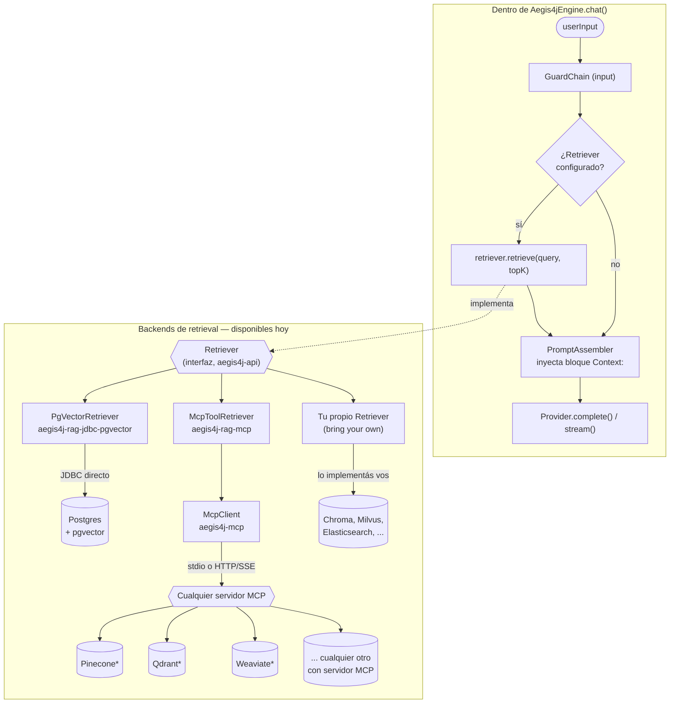

# Aegis4J

[](https://github.com/AndreLucasrs/aegis4j/actions/workflows/ci.yml)

[🇧🇷 Português](README.md) | [🇬🇧 English](README.en.md) | 🇪🇸 Español

Una librería para el ecosistema JVM (Java, Kotlin, Clojure, Scala) que se
sitúa delante de los LLM, combinando:

- **Abstracción de proveedor** — cambia de proveedor de LLM en tiempo de
  ejecución (Ollama, Anthropic, y cualquier backend compatible con la API de
  Chat Completions de OpenAI — la propia OpenAI, DeepSeek, Kimi/Moonshot,
  Groq, servidores locales, etc.) detrás de una interfaz `Provider` común.
- **Guardrails** — la mayoría corre en código puro (regex, límite de
  longitud, validación de JSON Schema), sin llamada a un LLM; un guard
  opcional (`HallucinationGuard`) delibera usando un segundo LLM como juez
  de grounding. Aplicados tanto en la entrada como en la salida.
- **Tool-calling opt-in** — un loop de ejecución de tools conectado al
  `chat()`, con el executor siempre provisto por quien embebe la librería
  (nunca automático/inseguro por defecto).
- **Observabilidad opt-in** — hooks (`EngineListener`) en cada fase del
  pipeline, con una implementación lista vía OpenTelemetry.
- **Usage/cost tracking opt-in** — agrega tokens por provider+model, con
  estimación de costo opcional a partir de un pricing configurado.
- **Skills con divulgación progresiva** — solo nombre+descripción entran en
  el prompt por defecto; el cuerpo completo de una skill solo se carga cuando
  se activa.
- **Distribución dual** — usable como librería embebida (dependencia
  Gradle/Maven) o como sidecar HTTP (formato de request/response compatible
  con OpenAI, incluyendo streaming vía SSE), así que cualquier lenguaje/CLI
  fuera de la JVM también puede usarla.
- **Cliente MCP** (stdio + HTTP/SSE) — se conecta a cualquier servidor MCP
  (Model Context Protocol) para exponer tools/resources externos.
- **RAG/retrieval extensible** — una única interfaz `Retriever` (vía
  pgvector directo por JDBC, o vía cualquier servidor MCP), más un pipeline
  de ingestión (loader → chunker → embed → pgvector) listo para usar.
- **Enrutamiento de modelo por reglas** — programáticas (Java) o
  declarativas (YAML), lo que defina quien use la librería; gana la primera
  regla que coincide.

Estado actual: **v0.3** — ver [Alcance y limitaciones](#alcance-y-limitaciones-v03)
al final.

## Dónde encontrar cada cosa

| Capacidad | Sección |
|---|---|
| Providers (Ollama, Anthropic, compatibles con OpenAI) | [Conectando cada provider](#conectando-cada-provider) |
| Guardrails (PII, longitud, prompt injection, JSON Schema, alucinación) | [Guardrails](#guardrails) |
| Skills con progressive disclosure | [Creando una skill declarativa](#creando-una-skill-declarativa) |
| Tool-calling (loop opt-in) | [Tool-calling](#tool-calling) |
| RAG/retrieval + ingestión de documentos | [RAG/retrieval](#ragretrieval) ([ingestión](#ingestión-de-documentos)) |
| Enrutamiento de modelo | [Enrutamiento de modelo](#enrutamiento-de-modelo) |
| Observabilidad/tracing | [Observabilidad](#observabilidad) |
| Usage/cost tracking | [Usage & cost tracking](#usage--cost-tracking) |
| Cliente MCP | [Cliente MCP](#cliente-mcp) |
| Servidor HTTP (sidecar) + streaming SSE | [Ejecutando el sidecar HTTP](#ejecutando-el-sidecar-http) |

## Requisitos

- Java 17+ (el toolchain del build usa Java 17 — cualquier JVM 17 o más
  reciente ejecuta la librería; no funciona en Java 8/11)
- [Ollama](https://ollama.com) corriendo localmente (`http://localhost:11434`)
  si querés respuestas reales en lugar de pruebas con fakes.

No se necesita instalación extra — el wrapper de Gradle (`./gradlew`) ya está
en el repositorio.

## Instalación vía JitPack

El código está publicado en [github.com/AndreLucasrs/aegis4j](https://github.com/AndreLucasrs/aegis4j)
y la tag `v0.3.0` ya builda en [JitPack](https://jitpack.io/#AndreLucasrs/aegis4j) — se puede
agregar como dependencia sin compilar desde cero:

**Gradle** (`build.gradle.kts`):

```kotlin
repositories {
    maven { url = uri("https://jitpack.io") }
}

dependencies {
    implementation("com.github.AndreLucasrs.aegis4j:aegis4j-core:<tag>")
    implementation("com.github.AndreLucasrs.aegis4j:aegis4j-provider-ollama:<tag>")
    // cualquier otro módulo: aegis4j-provider-anthropic, aegis4j-provider-openai,
    // aegis4j-mcp, aegis4j-rag-jdbc-pgvector, aegis4j-rag-mcp, aegis4j-routing,
    // aegis4j-guardrails-builtin, aegis4j-observability-otel, ...
}
```

**Maven** (`pom.xml`):

```xml
<repositories>
    <repository>
        <id>jitpack.io</id>
        <url>https://jitpack.io</url>
    </repository>
</repositories>

<dependency>
    <groupId>com.github.AndreLucasrs.aegis4j</groupId>
    <artifactId>aegis4j-core</artifactId>
    <version>TAG</version>
</dependency>
```

`<tag>`/`TAG` es una tag de release de GitHub (ej: `v0.2.0`) o un hash de
commit. El groupId `com.github.AndreLucasrs.aegis4j` es el patrón estándar de
JitPack para un proyecto multi-módulo (usuario.repositorio) — cada módulo se
convierte en su propio `artifactId`, así que declará solo los que realmente
usás.

## Build y pruebas

```bash
./gradlew build
```

Compila todos los módulos y ejecuta la suite de pruebas completa (guards,
skills, el provider de Ollama contra WireMock, y la prueba de aceptación del
server) — nada de esto toca red real.

## Ejecutando el sidecar HTTP

```bash
./gradlew :aegis4j-server:run
```

Variables de entorno (todas opcionales):

| Variable                     | Valor por defecto        | Descripción                                                |
|-------------------------------|---------------------------|----------------------------------------------------------|
| `AEGIS4J_PORT`                | `8686`                    | Puerto HTTP del sidecar                                    |
| `AEGIS4J_PROVIDER_ID`         | `ollama`                  | Provider activo                                             |
| `AEGIS4J_OLLAMA_BASE_URL`     | `http://localhost:11434`  | URL base de Ollama                                          |
| `AEGIS4J_MAX_INPUT_CHARS`     | `4000`                    | Tope de caracteres de entrada (`MaxLengthGuard`)            |
| `AEGIS4J_INJECTION_GUARDS`    | `on`                      | Guards de prompt injection (`PromptInjectionGuard` + `EncodedInjectionGuard`) en la entrada y en los chunks de RAG: `on`, `strict` (bloquea cualquier payload de texto codificado) u `off`. Un valor inválido impide que el servidor arranque |
| `AEGIS4J_SERVER_API_KEY`      | *(ninguno)*                | Protege el propio servidor: si está configurada, todo request a endpoints que no sean `/health` necesita el header `Authorization: Bearer <clave>`, si no devuelve `401`. Si no está configurada, el servidor queda abierto (comportamiento por defecto, compatible con versiones anteriores) |
| `AEGIS4J_SKILLS_DIR`          | *(ninguno)*                | Directorio con skills declarativas (`.md` + frontmatter)    |
| `AEGIS4J_RETRIEVER`           | *(ninguno)*                | `mcp` — activa retrieval vía MCP (`pgvector` lanza un error explícito en v0.2, ver [limitaciones](#alcance-y-limitaciones-v03)) |
| `AEGIS4J_MCP_RETRIEVER_TRANSPORT` | *(ninguno)*            | `stdio` o `http`                                             |
| `AEGIS4J_MCP_RETRIEVER_COMMAND`   | *(ninguno)*            | Comando del servidor MCP, si el transporte es `stdio`        |
| `AEGIS4J_MCP_RETRIEVER_URL`       | *(ninguno)*            | URL del servidor MCP, si el transporte es `http`             |
| `AEGIS4J_MCP_RETRIEVER_TOOL`      | `search`              | Nombre de la tool MCP usada para la búsqueda                  |
| `AEGIS4J_ROUTING_CONFIG`      | *(ninguno)*                | Ruta de un `routing.yaml` — activa el enrutamiento de `model` por request |
| `AEGIS4J_ANTHROPIC_API_KEY`   | *(ninguno)*                | Clave de API — con `AEGIS4J_PROVIDER_ID=anthropic`, `AnthropicProvider` se registra solo vía `ServiceLoader` |
| `AEGIS4J_OPENAI_COMPATIBLE_ID`      | *(ninguno)*          | Activa un `OpenAiCompatibleProvider` genérico (ej: `openai`, `deepseek`, `kimi`) — necesita `_BASE_URL` también |
| `AEGIS4J_OPENAI_COMPATIBLE_BASE_URL`| *(ninguno)*          | URL base del backend compatible con OpenAI                  |
| `AEGIS4J_OPENAI_COMPATIBLE_API_KEY` | *(ninguno)*          | Clave de API de ese backend, si hace falta                   |

> **Cambio de comportamiento por defecto:** el servidor ahora bloquea (HTTP 400) entradas con patrones de prompt injection, incluso codificados en Base64, Morse, etc. Para mantener el comportamiento anterior, definí `AEGIS4J_INJECTION_GUARDS=off`.

Ejemplo con la skill de ejemplo (`aegis4j-server/src/main/resources/skills`)
cargada:

```bash
AEGIS4J_SKILLS_DIR="$PWD/aegis4j-server/src/main/resources/skills" \
  ./gradlew :aegis4j-server:run
```

Health check:

```bash
curl http://localhost:8686/health
```

### Chat completions (formato compatible con OpenAI)

```bash
curl -X POST http://localhost:8686/v1/chat/completions \
  -H "Content-Type: application/json" \
  -d '{
        "model": "qwen2.5-coder:7b",
        "messages": [
          {"role": "user", "content": "what is the weather like today?"}
        ]
      }'
```

Respuesta:

```json
{
  "id": "ollama-...",
  "object": "chat.completion",
  "created": 1234567890,
  "model": "qwen2.5-coder:7b",
  "choices": [
    {"index": 0, "message": {"role": "assistant", "content": "..."}, "finish_reason": "stop"}
  ],
  "usage": {"prompt_tokens": 0, "completion_tokens": 0, "total_tokens": 0}
}
```

Si la entrada o la salida contiene un email, una clave de API, una tarjeta de
crédito válida (verificada con Luhn) o una IPv4, `RegexPiiGuard` la redacta
automáticamente antes de continuar en el pipeline. Una entrada más larga que
`AEGIS4J_MAX_INPUT_CHARS` se bloquea con HTTP 400.

**Streaming**: agregá `"stream": true` para recibir eventos
`chat.completion.chunk` vía SSE, terminando en `data: [DONE]`:

```bash
curl -N -X POST http://localhost:8686/v1/chat/completions \
  -H "Content-Type: application/json" \
  -d '{
        "model": "qwen2.5-coder:7b",
        "messages": [{"role": "user", "content": "contá hasta 3"}],
        "stream": true
      }'
```

```
data: {"id":"...","object":"chat.completion.chunk","created":...,"model":"qwen2.5-coder:7b","choices":[{"index":0,"delta":{"role":"assistant","content":""},"finish_reason":null}]}

data: {"id":"...","object":"chat.completion.chunk","created":...,"model":"qwen2.5-coder:7b","choices":[{"index":0,"delta":{"content":"1, 2, 3"},"finish_reason":null}]}

data: {"id":"...","object":"chat.completion.chunk","created":...,"model":"qwen2.5-coder:7b","choices":[{"index":0,"delta":{},"finish_reason":"stop"}]}

data: [DONE]
```

Los guards de salida (`RegexPiiGuard`, etc.) **no corren** en respuestas en
streaming — solo en `chat()` sin streaming. El streaming tampoco ejecuta el
loop de tool-calling (ver [Tool-calling](#tool-calling)) ni reporta uso a un
`UsageTracker` configurado (`CompletionChunk` todavía no carga `Usage`).

## Usándola como librería embebida (Java)

```java
ProviderRegistry providerRegistry = new ProviderRegistry();
providerRegistry.register(OllamaProvider.create());

SkillRegistry skillRegistry = SkillRegistry.inMemory();
new MarkdownSkillLoader().loadDirectory(Path.of("skills")).forEach(skillRegistry::register);

Aegis4jEngine engine = Aegis4jEngine.builder()
        .providerRegistry(providerRegistry)
        .guardChain(GuardChain.of(
                MaxLengthGuard.forInput(4000),
                RegexPiiGuard.allPatterns()
        ))
        .skillRegistry(skillRegistry)
        .build();

CompletionResponse response = engine.chat(ChatRequest.builder()
        .providerId(OllamaProvider.ID)
        .model("qwen2.5-coder:7b")
        .userInput("what is the weather like today?")
        .build());

System.out.println(response.content());
```

### Kotlin / Clojure / Scala

Como el core es Java puro, el consumo es interop de JVM directo:

```kotlin
val engine = Aegis4jEngine.builder()
    .provider(OllamaProvider.create())
    .build()

val response = engine.chat(
    ChatRequest.builder()
        .providerId(OllamaProvider.ID)
        .model("qwen2.5-coder:7b")
        .userInput("what is the weather like today?")
        .build()
)
println(response.content())
```

```clojure
(import '[dev.aegis4j.core.engine Aegis4jEngine ChatRequest]
        '[dev.aegis4j.provider.ollama OllamaProvider])

(def engine (-> (Aegis4jEngine/builder)
                (.provider (OllamaProvider/create))
                (.build)))

(def request (-> (ChatRequest/builder)
                  (.providerId OllamaProvider/ID)
                  (.model "qwen2.5-coder:7b")
                  (.userInput "what is the weather like today?")
                  (.build)))

(println (.content (.chat engine request)))
```

## Conectando cada provider

Todos implementan la misma interfaz `Provider` — cambiar en runtime es solo
registrar uno u otro. Ejemplos:

**Ollama** (local):

```java
providerRegistry.register(OllamaProvider.create()); // lee AEGIS4J_OLLAMA_BASE_URL, por defecto http://localhost:11434
```

**Anthropic**:

```java
providerRegistry.register(AnthropicProvider.create()); // lee AEGIS4J_ANTHROPIC_API_KEY
// o explícito:
providerRegistry.register(new AnthropicProvider(
        "https://api.anthropic.com", "sk-ant-...", HttpClient.newHttpClient(), Duration.ofSeconds(60)
));

engine.chat(ChatRequest.builder()
        .providerId(AnthropicProvider.ID)
        .model("claude-sonnet-5")
        .userInput("explicá qué es pgvector")
        .build());
```

**OpenAI**:

```java
providerRegistry.register(OpenAiCompatibleProvider.openAi()); // lee AEGIS4J_OPENAI_API_KEY

engine.chat(ChatRequest.builder()
        .providerId("openai")
        .model("gpt-5")
        .userInput("explicá qué es pgvector")
        .build());
```

**DeepSeek** (API compatible con la de OpenAI):

```java
providerRegistry.register(OpenAiCompatibleProvider.deepSeek()); // lee AEGIS4J_DEEPSEEK_API_KEY

engine.chat(ChatRequest.builder()
        .providerId("deepseek")
        .model("deepseek-chat")
        .userInput("explicá qué es pgvector")
        .build());
```

**Kimi (Moonshot AI), Groq, Together AI, OpenRouter, un servidor local
(vLLM/LM Studio), o cualquier otro backend compatible con la API de Chat
Completions de OpenAI** — usá `custom(...)` con el `id`, la `baseUrl` y la
`apiKey` de ese proveedor. ⚠️ Confirmá la base URL exacta en la documentación
actual del proveedor — cambia entre ellos (algunos usan prefijo `/v1`, otros
no) y puede cambiar con el tiempo:

```java
providerRegistry.register(OpenAiCompatibleProvider.custom(
        "kimi", "https://api.moonshot.ai/v1", System.getenv("AEGIS4J_KIMI_API_KEY")
));

engine.chat(ChatRequest.builder()
        .providerId("kimi")
        .model("kimi-latest")
        .userInput("explicá qué es pgvector")
        .build());
```

`baseUrl` debe incluir todo hasta (pero sin incluir) `/chat/completions` —
ej: `https://api.openai.com/v1` para OpenAI, `https://api.deepseek.com` para
DeepSeek (sin `/v1`).

### Circuit breaker / resiliencia

Aegis4J no incluye circuit breaker — cada `Provider`/`McpTransport`/
`PgVectorRetriever` solo tiene un `Duration timeout` explícito por llamada,
lo que ya evita quedarse esperando indefinidamente en una llamada individual,
pero no evita repetir el intento contra un servicio que ya se sabe caído.
Esto es deliberado: el umbral de fallo, el tiempo de half-open y qué cuenta
como "fallo" son decisiones de política que varían según el entorno, y mucha
gente ya corre Resilience4j, service mesh o health-checks de load balancer —
un circuit breaker interno solo competiría con eso.

Como `Provider` es solo una interfaz, podés envolverla con lo que ya usás,
sin tocar la librería. Ejemplo con
[Resilience4j](https://resilience4j.readme.io/):

```java
CircuitBreakerConfig config = CircuitBreakerConfig.custom()
        .failureRateThreshold(50)
        .waitDurationInOpenState(Duration.ofSeconds(30))
        .slidingWindowSize(10)
        .build();
CircuitBreaker circuitBreaker = CircuitBreaker.of("ollama", config);

Provider delegate = OllamaProvider.create();
Provider resilientProvider = new Provider() {
    @Override public String id() { return delegate.id(); }
    @Override public CompletionResponse complete(CompletionRequest request) {
        return circuitBreaker.executeSupplier(() -> delegate.complete(request));
    }
    @Override public Stream<CompletionChunk> stream(CompletionRequest request) {
        return circuitBreaker.executeSupplier(() -> delegate.stream(request));
    }
    @Override public List<ModelInfo> listModels() {
        return circuitBreaker.executeSupplier(delegate::listModels);
    }
};

providerRegistry.register(resilientProvider);
```

Con el circuito abierto, `executeSupplier` lanza `CallNotPermittedException`
(unchecked) — se propaga a través de `Aegis4jEngine.chat()` igual que ya
propaga una `ProviderException` hoy, sin necesitar tratamiento especial en
el engine. El mismo patrón de decorator funciona para `Retriever` y
`McpTransport`.

## Creando una skill declarativa

Creá un archivo `.md` con un bloque de frontmatter YAML:

```markdown
---
name: weather-explainer
description: Explains weather concepts in simple, non-technical terms.
triggers: [weather, forecast, clima]
---
You are an expert meteorologist. Explain weather phenomena in plain language...
```

El nombre/descripción/triggers siempre entran en el catálogo del system
prompt; el cuerpo solo se lee del disco y se inyecta cuando uno de los
`triggers` aparece en la entrada del usuario.

## RAG/retrieval

**Vector stores mapeados hoy**: nativamente (con cliente propio, JDBC
directo), solo **pgvector**. Eso no es una limitación fuerte, porque
`Retriever` es el único punto de contacto del engine — hay tres caminos para
usar cualquier otro backend sin tocar el engine:

1. **`PgVectorRetriever`** — JDBC directo contra Postgres+pgvector.
2. **`McpToolRetriever`** — delega a la tool de búsqueda de **cualquier
   servidor MCP**. Si el vector store que querés (Qdrant, Weaviate, Pinecone,
   Chroma, Milvus, ...) ya tiene un servidor MCP publicado (o escribís un
   wrapper fino que expone una tool `search`), ya funciona hoy, sin ninguna
   línea de código nueva en Aegis4J.
3. **Tu propio `Retriever`** — implementá la interfaz (2 métodos)
   directamente contra el cliente/SDK que ya usás. Del mismo tamaño que
   escribir el `PgVectorRetriever`.



<sup>* si ese vector store ya tiene (o construís) un servidor MCP con una
tool de búsqueda — confirmá en la documentación actual de cada uno, esto
cambia con el tiempo.</sup>

```java
// vía pgvector directo (JDBC) — el Embedder debe ser provisto por quien usa la librería (ver limitaciones)
Retriever pgvectorRetriever = new PgVectorRetriever(dataSource, embedder, PgVectorRetrieverConfig.defaults("document_chunks"));

// o vía cualquier servidor MCP con una tool de búsqueda
McpClient mcpClient = new McpClient(new StdioMcpTransport(List.of("mi-servidor-mcp"), Map.of(), Duration.ofSeconds(30)), "aegis4j", "0.2.0");
mcpClient.initialize();
Retriever mcpRetriever = new McpToolRetriever(mcpClient, "search", McpToolArgumentMapper.defaultMapper());

Aegis4jEngine engine = Aegis4jEngine.builder()
        .provider(OllamaProvider.create())
        .retriever(mcpRetriever) // cualquiera de los dos — el engine solo conoce la interfaz Retriever
        .build();
```

El retrieval se ejecuta en cada turno cuando hay un `Retriever` configurado
(v0.2 = incondicional, todavía sin filtrado por relevancia) y el resultado
entra en el prompt como un bloque `Context:` fresco en cada llamada.

### Ingestión de documentos

Para el lado de escritura (poblar pgvector), `aegis4j-rag-jdbc-pgvector`
también trae un pipeline `DocumentLoader` → `Chunker` → `PgVectorIngester`:

```java
DocumentLoader loader = new TextDocumentLoader(Path.of("docs")); // o MarkdownDocumentLoader(dir) para .md
Chunker chunker = new FixedSizeChunker(1000, 100); // tamaño del chunk, overlap en caracteres

PgVectorIngester ingester = new PgVectorIngester(
        dataSource, embedder, PgVectorRetrieverConfig.defaults("document_chunks"), chunker);

int chunksWritten = ingester.ingest(loader);
```

Reutiliza el mismo `PgVectorRetrieverConfig` que usa el `PgVectorRetriever`
(misma tabla, mismas columnas), así que escritura y lectura nunca se
desalinean de schema. Reingerir el mismo documento hace upsert
(`ON CONFLICT ... DO UPDATE`) y borra cualquier fila huérfana de una
ingestión anterior que haya generado más chunks que la versión actual — la
reingestión es una operación soportada, no una trampa.

> **En evaluación:** [PageIndex](https://github.com/VectifyAI/PageIndex)
> propone un RAG "vectorless" — en lugar de embeddings, genera un árbol
> jerárquico de la estructura del documento y usa un LLM para
> navegar/razonar sobre él. Solo tiene SDK de Python hoy, así que no se
> puede depender directo; la vía de integración más barata sería vía
> `McpToolRetriever` (`aegis4j-rag-mcp`), ya que su versión Cloud expone un
> servidor MCP — sin ningún código nuevo en la librería. No hay ninguna
> integración dedicada planeada por ahora, solo se documenta como opción
> conocida.

## Tool-calling

Opt-in — desactivado por defecto, así que ningún consumidor existente
cambia de comportamiento sin llamar esto explícitamente:

```java
ToolDefinition weatherTool = new ToolDefinition(
        "get_weather",
        "Returns the current weather for a city",
        Map.of("type", "object",
               "properties", Map.of("city", Map.of("type", "string")),
               "required", List.of("city")));

ToolExecutor executor = call -> {
    // call.argumentsJson() es el JSON crudo que mandó el modelo — parseá y validá vos mismo.
    // La ejecución siempre es responsabilidad de quien embebe la librería: aegis4j-core nunca
    // ejecuta nada por su cuenta ni decide qué es seguro llamar.
    return "{\"tempC\": 24, \"condition\": \"sunny\"}";
};

Aegis4jEngine engine = Aegis4jEngine.builder()
        .provider(OpenAiCompatibleProvider.openAi())
        .tools(List.of(weatherTool), executor)
        .maxToolIterations(5) // default; tope del total de llamadas al provider por chat(), la primera incluida
        .build();

CompletionResponse response = engine.chat(ChatRequest.builder()
        .providerId("openai").model("gpt-5")
        .userInput("¿cómo está el clima en São Paulo ahora?")
        .build());
```

Si el modelo pide una tool, el engine llama `executor.execute(call)`,
inyecta el resultado de vuelta en la conversación y llama al provider de
nuevo — hasta que la respuesta no pida más tools o se supere
`maxToolIterations` (`ToolCallLimitExceededException`). Una tool que lanza
una excepción no aborta el intercambio: el engine le da al modelo solo el
nombre de la clase de la excepción (nunca `e.getMessage()`, que puede
llevar detalle sensible) y deja que el modelo decida qué hacer.

**Limitaciones importantes:**

- **Solo funciona en `chat()`, no en `chatStream()`** — el streaming nunca
  manda `tools` ni inspecciona la respuesta por tool calls, aunque esté
  configurado.
- **Solo `OpenAiCompatibleProvider` manda `tools`/parsea `tool_calls`
  hoy** — `AnthropicProvider` y `OllamaProvider` ignoran `tools`
  silenciosamente (sin error, sin log). Ruteá el tool-calling a un provider
  compatible con OpenAI hasta que los otros dos ganen soporte.
- **La cadena de guards por defecto no cubre el loop**: solo la entrada
  inicial y la respuesta final pasan por ella. Los resultados de tools (vector
  clásico de prompt injection indirecta) y los chunks de RAG solo se verifican
  si configurás `untrustedContentGuards(...)` en el builder (ver
  [Guardrails](#guardrails)). El razonamiento del modelo entre llamadas nunca
  se sanitiza.

## Guardrails

| Guard | Qué hace |
|---|---|
| `MaxLengthGuard` | Bloquea texto por encima de un límite de caracteres (entrada y/o salida). |
| `RegexPiiGuard` | Redacta email, clave de API, tarjeta de crédito (verificada con Luhn), IPv4. |
| `PromptInjectionGuard` | Heurístico (regex bilingüe pt/en) contra patrones comunes de inyección — "ignora las instrucciones anteriores", exfiltración del system prompt, jailbreaks. **No es una frontera de seguridad**, es una señal más. |
| `EncodedInjectionGuard` | Detecta inyección oculta tras una codificación: Base64, hex, binario, Morse, percent/`\u`/entidades HTML, ROT13, texto invertido, caracteres Unicode invisibles ("ASCII smuggling"), full-width/homóglifos, leetspeak y capas combinadas (Base64 de Morse…). Decodifica hasta 3 capas y reaplica las heurísticas de `PromptInjectionGuard` a cada versión; si se agota el presupuesto de decodificación, **bloquea** (fail-closed). `EncodedInjectionGuard.strict()` bloquea cualquier payload de texto decodificable. Mismos límites: no decodifica un cifrado desconocido. |
| `JsonSchemaOutputGuard` | Valida que la salida sea JSON válido que cumpla un JSON Schema dado. |
| `HallucinationGuard` | LLM-as-judge: usa un segundo `Provider` para evaluar si la respuesta está fundamentada en el contexto recuperado (RAG). Modo `WARN` (default, anota una advertencia) o `STRICT` (bloquea); falla abierto ante cualquier fallo/respuesta no parseable del juez. |
| `GuardrailsAiGuard` | Delega la validación a un [Guardrails AI Server](https://github.com/guardrails-ai/guardrails-api) propio (validators del [Hub](https://guardrailsai.com/hub) o tuyos). **Fail-closed** por defecto. Módulo `aegis4j-guardrails-guardrailsai`. |

```java
GuardChain chain = GuardChain.of(
        MaxLengthGuard.forInput(4000),
        RegexPiiGuard.allPatterns(),
        PromptInjectionGuard.defaultPatterns(),
        EncodedInjectionGuard.defaultPatterns(),
        HallucinationGuard.warning(judgeProvider, "gpt-5-mini") // o .strict(...)
);
```

### Contenido no confiable (inyección indirecta)

Los chunks de RAG y los resultados de tools los lee el modelo pero no los
escribe quien llama — el camino típico de inyección indirecta. **No** pasan por
`guardChain`; configurá una cadena propia (opt-in, vacía por defecto):

```java
Aegis4jEngine engine = Aegis4jEngine.builder()
        .guardChain(chain)
        .untrustedContentGuards(GuardChain.of(
                PromptInjectionGuard.defaultPatterns(),
                EncodedInjectionGuard.defaultPatterns()))
        .build();
```

Un chunk bloqueado se **descarta** (la solicitud sigue, así un documento
envenenado no tumba el servicio); un resultado de tool bloqueado pasa a ser el
mensaje fijo `Tool result withheld by security policy`. Si un guard lanza
excepción, el contenido también se retiene (fail-closed). Nada del contenido
bloqueado llega al modelo.

`HallucinationGuard` solo llama al juez cuando hay contexto recuperado
(`Retriever` configurado) — sin RAG no hay nada contra qué comparar, así
que pasa directo sin costo extra.

### Guardrails AI Hub (opcional)

`GuardrailsAiGuard` envía el texto a un Guardrails Server propio (`POST /guards/{guard}/validate`):
si reprueba → bloquea; acción `fix` → usa el texto corregido; servidor caído, timeout o 401 →
bloquea (`FailMode.FAIL_OPEN` lo invierte).

```bash
pip install guardrails-ai guardrails-api
guardrails start --config config.py --port 8000
```

```java
GuardChain.of(
        EncodedInjectionGuard.defaultPatterns(),  // local y barato: corre antes de la llamada de red
        GuardrailsAiGuard.builder("http://localhost:8000", "mi-guard")
                .apiKey(token).timeout(Duration.ofSeconds(3)).build());
// en untrustedContentGuards (solo input): GuardrailsAiGuard.inputOnly(url, "mi-guard")
```

- **Privacidad:** el texto sale de la JVM hacia tu Guardrails Server. Revisá su telemetría: en las
  pruebas intentó exportar trazas OpenTelemetry a un host externo.
- **Latencia:** ~22 ms (p50) por llamada con un validator trivial local; los validators con ML
  cuestan más (no medido).
- **Probado:** guardrails-ai 0.6.8 / guardrails-api 0.1.0 con un validator propio (`fix`,
  `exception`, `noop`) y Bearer vía proxy. **No probado:** validators del Hub, guardrails-api 0.2.x.

## Observabilidad

Hooks opt-in (`EngineListener`) en cada fase del pipeline — sin ningún
listener configurado, costo cero:

```java
Aegis4jEngine engine = Aegis4jEngine.builder()
        .provider(OllamaProvider.create())
        .listener(new OtelEngineListener(openTelemetry)) // aegis4j-observability-otel
        .build();
```

`OtelEngineListener` crea un span por cada llamada a `chat()`/
`chatStream()`, completando atributos (`provider_id`, `model`, duración de
la llamada, tokens, `finish_reason`) a medida que cada fase termina. Para
implementar el tuyo: `EngineListener` tiene 8 métodos `default` vacíos
(`onChatStarted`, `onInputGuardComplete`, `onRetrievalComplete`,
`onRouteResolved`, `onProviderCallComplete`, `onOutputGuardComplete`,
`onChatComplete`, `onChatFailed`) — sobrescribí solo los que te interesen.
La excepción de un listener nunca afecta la respuesta real (se aísla y se
loguea, nunca se propaga) — ni siquiera un `Error` tumba el pipeline.

La dependencia de OpenTelemetry (`io.opentelemetry:opentelemetry-api`)
queda aislada en el módulo `aegis4j-observability-otel` — no se filtra a
`aegis4j-core`.

## Usage & cost tracking

```java
InMemoryUsageTracker tracker = new InMemoryUsageTracker(Map.of(
        "gpt-5", new InMemoryUsageTracker.PricingRate(0.005, 0.015) // costo por 1k tokens: prompt, completion
));

Aegis4jEngine engine = Aegis4jEngine.builder()
        .provider(OpenAiCompatibleProvider.openAi())
        .usageTracker(tracker)
        .build();

// después de algunos chat()...
long tokens = tracker.totalTokens("openai", "gpt-5");
double cost = tracker.estimatedCost("openai", "gpt-5");
```

Agrega por `providerId`+`model` (la clave es el model que pidió tu
`ChatRequest`, no necesariamente el que el provider devuelve — ej. `gpt-5`
vs. `gpt-5-2025-08-07` — configurá el pricing con la misma string que usan
tus requests). `InMemoryUsageTracker` es process-local, se reinicia con
cada restart de la JVM; para persistencia, implementá `UsageTracker` (una
interfaz de un método) contra tu propia base de datos/sistema de billing.
El streaming todavía no se rastrea (`CompletionChunk` no carga `Usage`).

## Enrutamiento de modelo

Programático:

```java
ModelRouter router = new ModelRouter(
        List.of(new KeywordRoutingRule(List.of("code", "bug"), new RouteTarget("ollama", "qwen2.5-coder:7b"))),
        new RouteTarget("ollama", "llama3.1:8b") // fallback obligatorio
);

Aegis4jEngine engine = Aegis4jEngine.builder()
        .provider(OllamaProvider.create())
        .modelRouter(router)
        .build();

// omitir providerId/model en ChatRequest deja que el router decida; un valor explícito siempre gana
engine.chat(ChatRequest.builder().userInput("ayuda con este bug").build());
```

Declarativo (`routing.yaml`):

```yaml
rules:
  - match: {keyword: [code, bug, refactor]}
    provider: ollama
    model: qwen2.5-coder:7b
  - match: {regex: "(?i)\\b(sql|database)\\b"}
    provider: ollama
    model: qwen2.5-coder:7b
default:
  provider: ollama
  model: llama3.1:8b
```

```java
YamlRoutingRuleLoader loader = new YamlRoutingRuleLoader();
ModelRouter router = new ModelRouter(loader.loadFile(path), loader.loadDefaultTarget(path));
```

`providerId`/`model` se resuelven **por campo** — podés fijar uno y dejar que
el router decida solo el otro.

## Cliente MCP

```java
McpTransport transport = new HttpSseMcpTransport(
        URI.create("https://mi-servidor-mcp/mcp"), Map.of(), HttpClient.newHttpClient(), Duration.ofSeconds(30)
); // o StdioMcpTransport(List.of("comando", "args"), Map.of(), Duration.ofSeconds(30))

McpClient client = new McpClient(transport, "aegis4j", "0.2.0");
client.initialize();
List<McpToolDescriptor> tools = client.listTools();
McpToolResult result = client.callTool("search", Map.of("query", "pgvector"));
```

Funciona con cualquier servidor MCP compatible — la librería no asume ningún
servidor específico. La capacidad `prompts/*` del protocolo MCP todavía no
está implementada (`listPrompts()` lanza `UnsupportedOperationException`
hasta v0.3).

## Módulos

| Módulo                           | Contenido                                                          |
|------------------------------------|-----------------------------------------------------------------|
| `aegis4j-api`                    | Contratos: `Provider`, `Guard`, `Skill`, `Persona`                  |
| `aegis4j-core`                   | `Aegis4jEngine`, `GuardChain`, `SkillRegistry`, `ProviderRegistry`   |
| `aegis4j-guardrails-builtin`     | `MaxLengthGuard`, `RegexPiiGuard`, `PromptInjectionGuard`, `EncodedInjectionGuard`, `JsonSchemaOutputGuard`, `HallucinationGuard` |
| `aegis4j-guardrails-guardrailsai` | `GuardrailsAiGuard` (adaptador HTTP para el Guardrails AI Server) |
| `aegis4j-skills`                 | `MarkdownSkillLoader`                                                |
| `aegis4j-provider-http-support`  | Plumbing HTTP compartido entre providers                            |
| `aegis4j-provider-ollama`        | `Provider` para Ollama                                               |
| `aegis4j-provider-openai`         | `OpenAiCompatibleProvider` — OpenAI, DeepSeek, Kimi/Moonshot, etc.  |
| `aegis4j-provider-anthropic`      | `Provider` para Anthropic (Messages API)                            |
| `aegis4j-server`                 | Sidecar HTTP (Javalin)                                                |
| `aegis4j-testkit`                | `FakeProvider`, `FakeRetriever` y helpers de prueba                  |
| `aegis4j-mcp`                     | Cliente MCP (`McpClient`, transportes stdio y HTTP/SSE)              |
| `aegis4j-rag-jdbc-pgvector`       | `PgVectorRetriever` (consulta) + `PgVectorIngester`/`DocumentLoader`/`Chunker` (ingestión) — JDBC directo, sin ORM |
| `aegis4j-rag-mcp`                 | `McpToolRetriever` (retrieval vía la tool de cualquier servidor MCP) |
| `aegis4j-routing`                 | `KeywordRoutingRule`, `RegexRoutingRule`, `YamlRoutingRuleLoader`     |
| `aegis4j-observability-otel`      | `OtelEngineListener` — implementación de `EngineListener` vía OpenTelemetry |

## Alcance y limitaciones (v0.3)

**v0.1** (se mantiene): provider Ollama, guards `MaxLengthGuard` +
`RegexPiiGuard`, skills declarativas con divulgación progresiva, server con
`POST /v1/chat/completions` (sin streaming) y `GET /health`.

**v0.2** (nuevo): cliente MCP completo (stdio + HTTP/SSE, `initialize`/
`listTools`/`callTool`/`listResources`/`readResource`); RAG vía
`PgVectorRetriever` (JDBC) y `McpToolRetriever` (MCP), inyección de contexto
incondicional en el prompt cuando hay un `Retriever` configurado;
enrutamiento de modelo vía `ModelRouter` — reglas programáticas
(`KeywordRoutingRule`, `RegexRoutingRule`) y declarativas (`routing.yaml`),
resueltas por campo (`providerId`/`model` independientes), un valor explícito
siempre gana sobre uno enrutado; `AnthropicProvider` (Messages API) y
`OpenAiCompatibleProvider` (cubre OpenAI, DeepSeek, Kimi/Moonshot y cualquier
otro backend compatible con la API de Chat Completions de OpenAI).

**v0.3** (nuevo): streaming SSE en el server (`"stream": true` en el
request, respuesta `text/event-stream` compatible con OpenAI); loop de
tool-calling opt-in (`Builder.tools(...)`, la ejecución siempre es
responsabilidad de quien embebe la librería — ver
[Tool-calling](#tool-calling)); guards nuevos — `PromptInjectionGuard`
(heurístico), `JsonSchemaOutputGuard`, `HallucinationGuard` (LLM-as-judge);
pipeline de ingestión RAG (`DocumentLoader`/`Chunker`/`PgVectorIngester`,
upsert + limpieza de huérfanos al reingerir); usage/cost tracking opt-in
(`UsageTracker`/`InMemoryUsageTracker`); observabilidad opt-in
(`EngineListener` + el módulo `aegis4j-observability-otel` vía
OpenTelemetry).

Fuera de alcance por ahora (planeado para v0.4+):

- Skills programáticas registradas en el server, persona
- Endpoints `/v1/skills`, `/v1/guards`, `/v1/models`, `/v1/config`
- Salida estructurada vía `ResponseFormat.JsonSchema` (el contrato ya existe
  en la API, pero todavía no se valida)
- Guards adicionales: `ProfanityBlocklistGuard`, `ContentTypeAllowlistGuard`,
  `CompetitorMentionGuard`
- Tool-calling en `chatStream()`; soporte de `tools` en
  `AnthropicProvider`/`OllamaProvider` (hoy ignoran `tools` silenciosamente);
  round-trip de tool-calling vía el server HTTP (`ChatMessageDto` no carga
  `toolCalls`/`toolCallId`)
- Usage/cost tracking en `chatStream()` (`CompletionChunk` todavía no carga
  `Usage`)
- La capacidad `prompts/*` del protocolo MCP (`McpClient.listPrompts()` lanza
  `UnsupportedOperationException`)
- Un `Embedder` concreto (`OllamaEmbedder`) — por eso
  `AEGIS4J_RETRIEVER=pgvector` en el server lanza un error explícito en v0.2;
  usá `PgVectorRetriever` directamente vía la API embebida, pasando tu propio
  `Embedder`
- `RetrievalTriggerStrategy` — v0.2 siempre recupera contexto cuando hay un
  `Retriever` configurado, sin filtrado por relevancia
- Enrutamiento de `providerId` por request vía el endpoint HTTP (en v0.2 solo
  se enruta `model` en ese camino; `providerId` sigue fijo vía
  `AEGIS4J_PROVIDER_ID`) — vía la API embebida ya funciona el enrutamiento de
  ambos
- Connection pooling/retry/circuit-breaker en `PgVectorRetriever`/`McpClient`

Los guards de salida (como `RegexPiiGuard`) necesitan el texto completo, así
que no están garantizados en `chatStream` — solo en `chat()` (modo sin
streaming).

`PgVectorRetriever` tiene una prueba de integración real (Testcontainers,
`pgvector/pgvector:pg16`) etiquetada `requires-docker`, excluida del `build`
por defecto — ejecutala vía
`./gradlew :aegis4j-rag-jdbc-pgvector:pgVectorIntegrationTest` (requiere que
Testcontainers pueda acceder a Docker).

## Licencia

Apache License 2.0 — la misma licencia que usan librerías como Jackson,
Javalin y WireMock. Texto completo en [`LICENSE`](LICENSE). Las dependencias
del proyecto mantienen sus propias licencias permisivas (Apache 2.0, MIT,
BSD, EPL, según corresponda).
