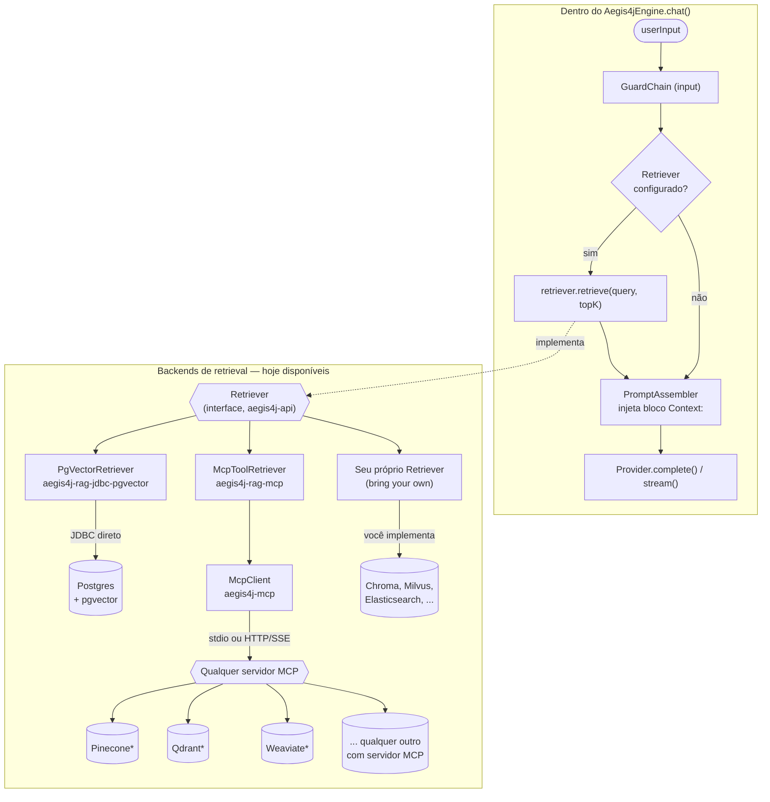

# Aegis4J

[](https://github.com/AndreLucasrs/aegis4j/actions/workflows/ci.yml)

🇧🇷 Português | [🇬🇧 English](README.en.md) | [🇪🇸 Español](README.es.md)

Uma lib para o ecossistema JVM (Java, Kotlin, Clojure, Scala) que fica na frente
de LLMs, combinando:

- **Provider abstraction** — troca de LLM em runtime (Ollama, Anthropic, e
  qualquer backend compatível com a API de Chat Completions da OpenAI — a
  própria OpenAI, DeepSeek, Kimi/Moonshot, Groq, servidores locais, etc.)
  atrás de uma interface `Provider` comum.
- **Guardrails** — a maioria roda em código puro (regex, limite de tamanho,
  validação de JSON Schema), sem chamada de LLM; um guard opcional
  (`HallucinationGuard`) delibera usando um segundo LLM como juiz de
  grounding. Aplicados em input e output.
- **Tool-calling opt-in** — loop de execução de tools no `chat()`, com
  executor sempre fornecido por quem embeda a lib (nunca automático/inseguro
  por padrão).
- **Observabilidade opt-in** — hooks (`EngineListener`) em cada fase do
  pipeline, com uma implementação pronta via OpenTelemetry.
- **Usage/cost tracking opt-in** — agrega tokens por provider+model, com
  estimativa de custo opcional a partir de um pricing configurado.
- **Skills com progressive disclosure** — só nome+descrição entram no prompt
  por padrão; o corpo completo de uma skill só é carregado quando ela é
  ativada.
- **Distribuição dupla** — usável como lib embarcada (dependência Gradle/Maven)
  ou como sidecar HTTP (compatível com o formato de request/response da
  OpenAI, incluindo streaming via SSE), então qualquer linguagem/CLI fora da
  JVM também pode usar.
- **Cliente MCP** (stdio + HTTP/SSE) — conecta em qualquer servidor MCP
  (Model Context Protocol) para expor tools/resources externos.
- **RAG/retrieval extensível** — uma interface `Retriever` única (via
  pgvector direto por JDBC, ou via qualquer servidor MCP), mais um pipeline
  de ingestão (loader → chunker → embed → pgvector) pronto pra uso.
- **Roteamento de modelo por regras** — programáticas (Java) ou declarativas
  (YAML), a pessoa que usa a lib define; primeira regra que casa vence.

Status atual: **v0.3** — ver [Escopo e limitações](#escopo-e-limitações-v03)
no final.

## Onde encontrar cada coisa

| Capacidade | Seção |
|---|---|
| Providers (Ollama, Anthropic, OpenAI-compatible) | [Conectando em cada provider](#conectando-em-cada-provider) |
| Guardrails (PII, tamanho, prompt injection, JSON Schema, hallucination) | [Guardrails](#guardrails) |
| Skills com progressive disclosure | [Criando uma skill declarativa](#criando-uma-skill-declarativa) |
| Tool-calling (loop opt-in) | [Tool-calling](#tool-calling) |
| RAG/retrieval + ingestão de documentos | [RAG/retrieval](#ragretrieval) ([ingestão](#ingestão-de-documentos)) |
| Roteamento de modelo | [Roteamento de modelo](#roteamento-de-modelo) |
| Observabilidade/tracing | [Observabilidade](#observabilidade) |
| Usage/cost tracking | [Usage & cost tracking](#usage--cost-tracking) |
| Cliente MCP | [Cliente MCP](#cliente-mcp) |
| Servidor HTTP (sidecar) + streaming SSE | [Rodando o sidecar HTTP](#rodando-o-sidecar-http) |

## Requisitos

- Java 17+ (toolchain do build usa Java 17 — qualquer JVM 17 ou mais nova roda
  a lib; não funciona em Java 8/11)
- [Ollama](https://ollama.com) rodando localmente (`http://localhost:11434`)
  se você quiser respostas reais em vez de testes com fakes.

Nenhuma instalação extra é necessária — o wrapper do Gradle (`./gradlew`) já
está no repositório.

## Instalação via JitPack

O código está publicado em [github.com/AndreLucasrs/aegis4j](https://github.com/AndreLucasrs/aegis4j)
e a tag `v0.3.0` já builda no [JitPack](https://jitpack.io/#AndreLucasrs/aegis4j) — dá pra
adicionar como dependência sem compilar do zero:

**Gradle** (`build.gradle.kts`):

```kotlin
repositories {
    maven { url = uri("https://jitpack.io") }
}

dependencies {
    implementation("com.github.AndreLucasrs.aegis4j:aegis4j-core:<tag>")
    implementation("com.github.AndreLucasrs.aegis4j:aegis4j-provider-ollama:<tag>")
    // qualquer outro módulo: aegis4j-provider-anthropic, aegis4j-provider-openai,
    // aegis4j-mcp, aegis4j-rag-jdbc-pgvector, aegis4j-rag-mcp, aegis4j-routing,
    // aegis4j-guardrails-builtin, aegis4j-observability-otel, ...
}
```

**Maven** (`pom.xml`):

```xml
<repositories>
    <repository>
        <id>jitpack.io</id>
        <url>https://jitpack.io</url>
    </repository>
</repositories>

<dependency>
    <groupId>com.github.AndreLucasrs.aegis4j</groupId>
    <artifactId>aegis4j-core</artifactId>
    <version>TAG</version>
</dependency>
```

`<tag>`/`TAG` é uma tag de release do GitHub (ex: `v0.2.0`) ou um hash de
commit. O groupId `com.github.AndreLucasrs.aegis4j` é o padrão do JitPack
para projeto multi-módulo (usuário.repositório) — cada módulo do projeto vira
um `artifactId` separado, então só declare os módulos que você realmente usa.

## Build e testes

```bash
./gradlew build
```

Compila todos os módulos e roda a suíte de testes (guards, skills, provider
Ollama contra WireMock, e o teste de aceitação do server) — nada disso toca
rede real.

## Rodando o sidecar HTTP

```bash
./gradlew :aegis4j-server:run
```

Variáveis de ambiente (todas opcionais):

| Variável                     | Padrão                   | Descrição                                               |
|-------------------------------|---------------------------|----------------------------------------------------------|
| `AEGIS4J_PORT`                | `8686`                    | Porta HTTP do sidecar                                    |
| `AEGIS4J_PROVIDER_ID`         | `ollama`                  | Provider ativo                                           |
| `AEGIS4J_OLLAMA_BASE_URL`     | `http://localhost:11434`  | Base URL do Ollama                                       |
| `AEGIS4J_MAX_INPUT_CHARS`     | `4000`                    | Teto de caracteres de input (guard `MaxLengthGuard`)      |
| `AEGIS4J_SERVER_API_KEY`      | *(nenhum)*                | Protege o próprio servidor: se setada, todo request para endpoints não-`/health` precisa do header `Authorization: Bearer <chave>`, senão retorna `401`. Se não setada, o servidor fica aberto (comportamento padrão, compatível com versões anteriores) |
| `AEGIS4J_SKILLS_DIR`          | *(nenhum)*                | Diretório com skills declarativas (`.md` + frontmatter)   |
| `AEGIS4J_RETRIEVER`           | *(nenhum)*                | `mcp` — ativa retrieval via MCP (`pgvector` lança erro explícito em v0.2, ver [limitações](#escopo-e-limitações-v03)) |
| `AEGIS4J_MCP_RETRIEVER_TRANSPORT` | *(nenhum)*            | `stdio` ou `http`                                          |
| `AEGIS4J_MCP_RETRIEVER_COMMAND`   | *(nenhum)*            | Comando do servidor MCP, se transporte `stdio`             |
| `AEGIS4J_MCP_RETRIEVER_URL`       | *(nenhum)*            | URL do servidor MCP, se transporte `http`                  |
| `AEGIS4J_MCP_RETRIEVER_TOOL`      | `search`              | Nome da tool MCP usada para busca                           |
| `AEGIS4J_ROUTING_CONFIG`      | *(nenhum)*                | Caminho de um `routing.yaml` — ativa roteamento de `model` por request |
| `AEGIS4J_ANTHROPIC_API_KEY`   | *(nenhum)*                | Chave de API — com `AEGIS4J_PROVIDER_ID=anthropic`, o `AnthropicProvider` se registra automaticamente via `ServiceLoader` |
| `AEGIS4J_OPENAI_COMPATIBLE_ID`      | *(nenhum)*          | Ativa um `OpenAiCompatibleProvider` genérico (ex: `openai`, `deepseek`, `kimi`) — precisa de `_BASE_URL` também |
| `AEGIS4J_OPENAI_COMPATIBLE_BASE_URL`| *(nenhum)*          | Base URL do backend compatível com OpenAI                  |
| `AEGIS4J_OPENAI_COMPATIBLE_API_KEY` | *(nenhum)*          | Chave de API do backend, se precisar                        |

Exemplo com a skill de exemplo (`aegis4j-server/src/main/resources/skills`)
carregada:

```bash
AEGIS4J_SKILLS_DIR="$PWD/aegis4j-server/src/main/resources/skills" \
  ./gradlew :aegis4j-server:run
```

Health check:

```bash
curl http://localhost:8686/health
```

### Chat completions (compatível com o formato OpenAI)

```bash
curl -X POST http://localhost:8686/v1/chat/completions \
  -H "Content-Type: application/json" \
  -d '{
        "model": "qwen2.5-coder:7b",
        "messages": [
          {"role": "user", "content": "what is the weather like today?"}
        ]
      }'
```

Resposta:

```json
{
  "id": "ollama-...",
  "object": "chat.completion",
  "created": 1234567890,
  "model": "qwen2.5-coder:7b",
  "choices": [
    {"index": 0, "message": {"role": "assistant", "content": "..."}, "finish_reason": "stop"}
  ],
  "usage": {"prompt_tokens": 0, "completion_tokens": 0, "total_tokens": 0}
}
```

Se o input ou output contiver e-mail, chave de API, cartão de crédito válido
(checagem de Luhn) ou IPv4, o `RegexPiiGuard` redige automaticamente antes de
seguir no pipeline. Um input maior que `AEGIS4J_MAX_INPUT_CHARS` é bloqueado
com HTTP 400.

**Streaming**: adicione `"stream": true` pra receber `chat.completion.chunk`
via SSE, terminando em `data: [DONE]`:

```bash
curl -N -X POST http://localhost:8686/v1/chat/completions \
  -H "Content-Type: application/json" \
  -d '{
        "model": "qwen2.5-coder:7b",
        "messages": [{"role": "user", "content": "conte até 3"}],
        "stream": true
      }'
```

```
data: {"id":"...","object":"chat.completion.chunk","created":...,"model":"qwen2.5-coder:7b","choices":[{"index":0,"delta":{"role":"assistant","content":""},"finish_reason":null}]}

data: {"id":"...","object":"chat.completion.chunk","created":...,"model":"qwen2.5-coder:7b","choices":[{"index":0,"delta":{"content":"1, 2, 3"},"finish_reason":null}]}

data: {"id":"...","object":"chat.completion.chunk","created":...,"model":"qwen2.5-coder:7b","choices":[{"index":0,"delta":{},"finish_reason":"stop"}]}

data: [DONE]
```

Guards de output (`RegexPiiGuard`, etc.) **não rodam** em respostas
streamed — só em `chat()` não-streaming. Streaming também não roda o loop de
tool-calling (ver [Tool-calling](#tool-calling)) e não reporta uso pro
`UsageTracker` configurado (`CompletionChunk` não carrega `Usage` ainda).

## Usando como lib embarcada (Java)

```java
ProviderRegistry providerRegistry = new ProviderRegistry();
providerRegistry.register(OllamaProvider.create());

SkillRegistry skillRegistry = SkillRegistry.inMemory();
new MarkdownSkillLoader().loadDirectory(Path.of("skills")).forEach(skillRegistry::register);

Aegis4jEngine engine = Aegis4jEngine.builder()
        .providerRegistry(providerRegistry)
        .guardChain(GuardChain.of(
                MaxLengthGuard.forInput(4000),
                RegexPiiGuard.allPatterns()
        ))
        .skillRegistry(skillRegistry)
        .build();

CompletionResponse response = engine.chat(ChatRequest.builder()
        .providerId(OllamaProvider.ID)
        .model("qwen2.5-coder:7b")
        .userInput("what is the weather like today?")
        .build());

System.out.println(response.content());
```

### Kotlin / Clojure / Scala

Como o core é Java puro, o consumo é interop JVM direto:

```kotlin
val engine = Aegis4jEngine.builder()
    .provider(OllamaProvider.create())
    .build()

val response = engine.chat(
    ChatRequest.builder()
        .providerId(OllamaProvider.ID)
        .model("qwen2.5-coder:7b")
        .userInput("what is the weather like today?")
        .build()
)
println(response.content())
```

```clojure
(import '[dev.aegis4j.core.engine Aegis4jEngine ChatRequest]
        '[dev.aegis4j.provider.ollama OllamaProvider])

(def engine (-> (Aegis4jEngine/builder)
                (.provider (OllamaProvider/create))
                (.build)))

(def request (-> (ChatRequest/builder)
                  (.providerId OllamaProvider/ID)
                  (.model "qwen2.5-coder:7b")
                  (.userInput "what is the weather like today?")
                  (.build)))

(println (.content (.chat engine request)))
```

## Conectando em cada provider

Todos implementam a mesma interface `Provider` — troca em runtime é só
registrar um ou outro. Exemplos:

**Ollama** (local):

```java
providerRegistry.register(OllamaProvider.create()); // lê AEGIS4J_OLLAMA_BASE_URL, default http://localhost:11434
```

**Anthropic**:

```java
providerRegistry.register(AnthropicProvider.create()); // lê AEGIS4J_ANTHROPIC_API_KEY
// ou explícito:
providerRegistry.register(new AnthropicProvider(
        "https://api.anthropic.com", "sk-ant-...", HttpClient.newHttpClient(), Duration.ofSeconds(60)
));

engine.chat(ChatRequest.builder()
        .providerId(AnthropicProvider.ID)
        .model("claude-sonnet-5")
        .userInput("explique o que é pgvector")
        .build());
```

**OpenAI**:

```java
providerRegistry.register(OpenAiCompatibleProvider.openAi()); // lê AEGIS4J_OPENAI_API_KEY

engine.chat(ChatRequest.builder()
        .providerId("openai")
        .model("gpt-5")
        .userInput("explique o que é pgvector")
        .build());
```

**DeepSeek** (API compatível com a da OpenAI):

```java
providerRegistry.register(OpenAiCompatibleProvider.deepSeek()); // lê AEGIS4J_DEEPSEEK_API_KEY

engine.chat(ChatRequest.builder()
        .providerId("deepseek")
        .model("deepseek-chat")
        .userInput("explique o que é pgvector")
        .build());
```

**Kimi (Moonshot AI), Groq, Together AI, OpenRouter, um servidor local
(vLLM/LM Studio), ou qualquer outro backend compatível com a API de Chat
Completions da OpenAI** — use `custom(...)` com o `id`, a `baseUrl` e a
`apiKey` desse provedor. ⚠️ Confirme a base URL exata na documentação atual
do provedor — muda entre eles (alguns usam prefixo `/v1`, outros não) e pode
mudar com o tempo:

```java
providerRegistry.register(OpenAiCompatibleProvider.custom(
        "kimi", "https://api.moonshot.ai/v1", System.getenv("AEGIS4J_KIMI_API_KEY")
));

engine.chat(ChatRequest.builder()
        .providerId("kimi")
        .model("kimi-latest")
        .userInput("explique o que é pgvector")
        .build());
```

`baseUrl` deve incluir tudo até (mas sem incluir) `/chat/completions` — ex:
`https://api.openai.com/v1` para OpenAI, `https://api.deepseek.com` para
DeepSeek (sem `/v1`).

### Circuit breaker / resiliência

O Aegis4J não embute circuit breaker — cada `Provider`/`McpTransport`/
`PgVectorRetriever` só tem um `Duration timeout` explícito por chamada, o que
já evita ficar esperando indefinidamente numa chamada individual, mas não
evita repetir a tentativa contra um serviço que já se sabe fora. Isso é
proposital: threshold de falha, tempo de half-open e o que conta como "falha"
são decisões de política que variam por ambiente, e muita gente já roda
Resilience4j, service mesh ou health-check de load balancer — um circuit
breaker interno só competiria com isso.

Como `Provider` é só uma interface, dá pra envolver com o que você já usa
sem tocar na lib. Exemplo com [Resilience4j](https://resilience4j.readme.io/):

```java
CircuitBreakerConfig config = CircuitBreakerConfig.custom()
        .failureRateThreshold(50)
        .waitDurationInOpenState(Duration.ofSeconds(30))
        .slidingWindowSize(10)
        .build();
CircuitBreaker circuitBreaker = CircuitBreaker.of("ollama", config);

Provider delegate = OllamaProvider.create();
Provider resilientProvider = new Provider() {
    @Override public String id() { return delegate.id(); }
    @Override public CompletionResponse complete(CompletionRequest request) {
        return circuitBreaker.executeSupplier(() -> delegate.complete(request));
    }
    @Override public Stream<CompletionChunk> stream(CompletionRequest request) {
        return circuitBreaker.executeSupplier(() -> delegate.stream(request));
    }
    @Override public List<ModelInfo> listModels() {
        return circuitBreaker.executeSupplier(delegate::listModels);
    }
};

providerRegistry.register(resilientProvider);
```

Com o circuito aberto, `executeSupplier` lança `CallNotPermittedException`
(unchecked) — propaga pelo `Aegis4jEngine.chat()` do mesmo jeito que uma
`ProviderException` já propaga hoje, sem precisar de tratamento especial no
engine. O mesmo padrão de decorator funciona pra `Retriever` e `McpTransport`.

## Criando uma skill declarativa

Crie um arquivo `.md` com frontmatter YAML:

```markdown
---
name: weather-explainer
description: Explains weather concepts in simple, non-technical terms.
triggers: [weather, forecast, clima]
---
You are an expert meteorologist. Explain weather phenomena in plain language...
```

O nome/descrição/triggers entram sempre no catálogo do system prompt; o corpo
só é lido do disco e injetado quando uma das `triggers` aparece no input do
usuário.

## RAG/retrieval

**Vector stores mapeados hoje**: nativamente (com cliente próprio, tipo JDBC
direto), só **pgvector**. Isso não é uma limitação forte, porque a interface
`Retriever` é o único ponto de contato do engine — e existem três caminhos
pra usar qualquer outro backend sem tocar no engine:

1. **`PgVectorRetriever`** — JDBC direto contra Postgres+pgvector.
2. **`McpToolRetriever`** — delega pra tool de busca de **qualquer servidor
   MCP**. Se o vector store que você quer (Qdrant, Weaviate, Pinecone, Chroma,
   Milvus, ...) já tiver um servidor MCP publicado (ou você escrever um
   wrapper fino que exponha uma tool `search`), já funciona hoje, sem
   nenhuma linha de código nova no Aegis4J.
3. **Seu próprio `Retriever`** — implementa a interface (2 métodos) direto
   contra o client/SDK que você já usa. Do mesmo tamanho que escrever o
   `PgVectorRetriever` foi.



<sup>* se esse vector store já tiver (ou você criar) um servidor MCP com uma
tool de busca — confirme na documentação atual de cada um, isso muda com o
tempo.</sup>

```java
// via pgvector direto (JDBC) — Embedder precisa ser fornecido por quem usa a lib (ver limitações)
Retriever pgvectorRetriever = new PgVectorRetriever(dataSource, embedder, PgVectorRetrieverConfig.defaults("document_chunks"));

// ou via qualquer servidor MCP com uma tool de busca
McpClient mcpClient = new McpClient(new StdioMcpTransport(List.of("meu-mcp-server"), Map.of(), Duration.ofSeconds(30)), "aegis4j", "0.2.0");
mcpClient.initialize();
Retriever mcpRetriever = new McpToolRetriever(mcpClient, "search", McpToolArgumentMapper.defaultMapper());

Aegis4jEngine engine = Aegis4jEngine.builder()
        .provider(OllamaProvider.create())
        .retriever(mcpRetriever) // qualquer um dos dois — o engine só conhece a interface Retriever
        .build();
```

Retrieval roda a cada turno quando um `Retriever` está configurado (v0.2 =
incondicional, sem gating por relevância ainda) e o resultado entra no prompt
como um bloco `Context:` fresco a cada chamada.

### Ingestão de documentos

Pro lado de escrita (popular o pgvector), `aegis4j-rag-jdbc-pgvector` também
traz um pipeline `DocumentLoader` → `Chunker` → `PgVectorIngester`:

```java
DocumentLoader loader = new TextDocumentLoader(Path.of("docs")); // ou MarkdownDocumentLoader(dir) para .md
Chunker chunker = new FixedSizeChunker(1000, 100); // tamanho do chunk, overlap em caracteres

PgVectorIngester ingester = new PgVectorIngester(
        dataSource, embedder, PgVectorRetrieverConfig.defaults("document_chunks"), chunker);

int chunksWritten = ingester.ingest(loader);
```

Reusa o mesmo `PgVectorRetrieverConfig` do `PgVectorRetriever` (mesma tabela,
mesmas colunas), então escrita e leitura nunca desalinham de schema.
Reingerir o mesmo documento faz upsert (`ON CONFLICT ... DO UPDATE`) e apaga
qualquer linha órfã de uma ingestão anterior que tenha gerado mais chunks do
que a versão atual — reingestão é uma operação suportada, não uma pegadinha.

> **Em avaliação:** [PageIndex](https://github.com/VectifyAI/PageIndex)
> propõe um RAG "vectorless" — em vez de embeddings, gera uma árvore
> hierárquica da estrutura do documento e usa um LLM pra navegar/raciocinar
> sobre ela. Só tem SDK Python hoje, então não dá pra depender direto; a via
> de integração mais barata seria via `McpToolRetriever`
> (`aegis4j-rag-mcp`), já que a versão Cloud deles expõe um servidor MCP —
> sem nenhum código novo na lib. Nenhuma integração dedicada planejada por
> ora, só documentando como opção conhecida.

## Tool-calling

Opt-in — desligado por padrão, então nenhum consumidor existente muda de
comportamento sem chamar isso explicitamente:

```java
ToolDefinition weatherTool = new ToolDefinition(
        "get_weather",
        "Returns the current weather for a city",
        Map.of("type", "object",
               "properties", Map.of("city", Map.of("type", "string")),
               "required", List.of("city")));

ToolExecutor executor = call -> {
    // call.argumentsJson() é o JSON cru que o modelo mandou — parseie e valide você mesmo.
    // Execução é sempre responsabilidade de quem embeda a lib: aegis4j-core nunca roda nada
    // por conta própria nem decide o que é seguro chamar.
    return "{\"tempC\": 24, \"condition\": \"sunny\"}";
};

Aegis4jEngine engine = Aegis4jEngine.builder()
        .provider(OpenAiCompatibleProvider.openAi())
        .tools(List.of(weatherTool), executor)
        .maxToolIterations(5) // default; cap no total de chamadas ao provider por chat(), a primeira incluída
        .build();

CompletionResponse response = engine.chat(ChatRequest.builder()
        .providerId("openai").model("gpt-5")
        .userInput("qual o clima em São Paulo agora?")
        .build());
```

Se o modelo pedir uma tool, o engine chama `executor.execute(call)`, injeta o
resultado de volta na conversa e chama o provider de novo — até a resposta
não pedir mais tools ou `maxToolIterations` estourar
(`ToolCallLimitExceededException`). Uma tool que lança exceção não aborta a
troca: o engine alimenta o modelo só com o nome da classe da exceção (nunca
`e.getMessage()`, que pode carregar detalhe sensível) e deixa o modelo
decidir o que fazer.

**Limitações importantes:**

- **Só funciona em `chat()`, não em `chatStream()`** — streaming nunca manda
  `tools` nem inspeciona a resposta por tool calls, mesmo se configurado.
- **Só o `OpenAiCompatibleProvider` de fato manda `tools`/parseia
  `tool_calls` hoje** — `AnthropicProvider` e `OllamaProvider` ignoram
  `tools` silenciosamente (sem erro, sem log). Roteie tool-calling pra um
  provider compatível com OpenAI até os outros ganharem suporte.
- **O guard chain padrão não cobre o loop**: só o input inicial e a resposta
  final passam por ele. Resultados de tool (vetor clássico de prompt injection
  indireto) e chunks de RAG só são verificados se você configurar
  `untrustedContentGuards(...)` no builder (veja [Guardrails](#guardrails)).
  O raciocínio do modelo entre chamadas nunca é sanitizado.

## Guardrails

| Guard | O que faz |
|---|---|
| `MaxLengthGuard` | Bloqueia texto acima de um limite de caracteres (input e/ou output). |
| `RegexPiiGuard` | Redige e-mail, chave de API, cartão de crédito (checagem de Luhn), IPv4. |
| `PromptInjectionGuard` | Heurístico (regex bilíngue pt/en) contra padrões comuns de injeção — "ignore instruções anteriores", exfiltração de system prompt, jailbreak. **Não é uma fronteira de segurança**, é um sinal a mais. |
| `EncodedInjectionGuard` | Pega injeção escondida em codificação: Base64, hex, binário, Morse, percent/`\u`/entidades HTML, ROT13, texto invertido, caracteres Unicode invisíveis ("ASCII smuggling"), full-width/homóglifos, leetspeak e camadas combinadas (Base64 de Morse…). Decodifica até 3 camadas e reaplica as heurísticas do `PromptInjectionGuard` em cada versão; estourou o orçamento de decodificação, **bloqueia** (fail-closed). `EncodedInjectionGuard.strict()` bloqueia qualquer payload de texto decodificável. Mesmas limitações: não decodifica cifra desconhecida. |
| `JsonSchemaOutputGuard` | Valida que o output é JSON válido batendo um JSON Schema fornecido. |
| `HallucinationGuard` | LLM-as-judge: usa um segundo `Provider` pra avaliar se a resposta está fundamentada no contexto recuperado (RAG). Modo `WARN` (default, anota aviso) ou `STRICT` (bloqueia); fail-open em qualquer falha/resposta não-parseável do juiz. |

```java
GuardChain chain = GuardChain.of(
        MaxLengthGuard.forInput(4000),
        RegexPiiGuard.allPatterns(),
        PromptInjectionGuard.defaultPatterns(),
        EncodedInjectionGuard.defaultPatterns(),
        HallucinationGuard.warning(judgeProvider, "gpt-5-mini") // ou .strict(...)
);
```

### Conteúdo não confiável (injeção indireta)

Chunks de RAG e resultados de tools são lidos pelo modelo, mas não digitados
por quem chama — o caminho típico de injeção indireta. Eles **não** passam pelo
`guardChain`; configure uma chain própria (opt-in, vazia por padrão):

```java
Aegis4jEngine engine = Aegis4jEngine.builder()
        .guardChain(chain)
        .untrustedContentGuards(GuardChain.of(
                PromptInjectionGuard.defaultPatterns(),
                EncodedInjectionGuard.defaultPatterns()))
        .build();
```

Chunk bloqueado é **descartado** (a requisição segue, então um documento
envenenado não derruba o serviço); resultado de tool bloqueado vira a mensagem
fixa `Tool result withheld by security policy`. Se um guard lançar exceção,
o conteúdo também é retido (fail-closed). Nada do conteúdo bloqueado chega ao
modelo.

`HallucinationGuard` só chama o juiz quando existe contexto recuperado
(`Retriever` configurado) — sem RAG, não tem contra o que comparar, então
passa direto sem custo extra.

## Observabilidade

Hooks opt-in (`EngineListener`) em cada fase do pipeline — nenhum listener
configurado, zero custo:

```java
Aegis4jEngine engine = Aegis4jEngine.builder()
        .provider(OllamaProvider.create())
        .listener(new OtelEngineListener(openTelemetry)) // aegis4j-observability-otel
        .build();
```

`OtelEngineListener` cria um span por `chat()`/`chatStream()`, preenchendo
atributos (`provider_id`, `model`, duração da chamada, tokens,
`finish_reason`) conforme cada fase termina. Pra implementar o seu:
`EngineListener` tem 8 métodos `default` vazios (`onChatStarted`,
`onInputGuardComplete`, `onRetrievalComplete`, `onRouteResolved`,
`onProviderCallComplete`, `onOutputGuardComplete`, `onChatComplete`,
`onChatFailed`) — sobrescreva só os que interessar. Exceção de um listener
nunca afeta a resposta real (isolada e logada, nunca propagada) — nem mesmo
um `Error` derruba o pipeline.

Dependência do OpenTelemetry (`io.opentelemetry:opentelemetry-api`) fica
isolada no módulo `aegis4j-observability-otel` — não vaza pro
`aegis4j-core`.

## Usage & cost tracking

```java
InMemoryUsageTracker tracker = new InMemoryUsageTracker(Map.of(
        "gpt-5", new InMemoryUsageTracker.PricingRate(0.005, 0.015) // custo por 1k tokens: prompt, completion
));

Aegis4jEngine engine = Aegis4jEngine.builder()
        .provider(OpenAiCompatibleProvider.openAi())
        .usageTracker(tracker)
        .build();

// depois de alguns chat()...
long tokens = tracker.totalTokens("openai", "gpt-5");
double cost = tracker.estimatedCost("openai", "gpt-5");
```

Agrega por `providerId`+`model` (a chave é o model que o `ChatRequest`
pediu, não necessariamente o que o provider ecoa de volta — ex. `gpt-5` vs.
`gpt-5-2025-08-07` — configure o pricing pela mesma string que você usa nos
seus requests). `InMemoryUsageTracker` é process-local, reseta a cada
restart da JVM; pra persistência, implemente `UsageTracker` (uma interface
de um método) contra seu próprio banco/sistema de billing. Streaming ainda
não é rastreado (`CompletionChunk` não carrega `Usage`).

## Roteamento de modelo

Programático:

```java
ModelRouter router = new ModelRouter(
        List.of(new KeywordRoutingRule(List.of("code", "bug"), new RouteTarget("ollama", "qwen2.5-coder:7b"))),
        new RouteTarget("ollama", "llama3.1:8b") // fallback obrigatório
);

Aegis4jEngine engine = Aegis4jEngine.builder()
        .provider(OllamaProvider.create())
        .modelRouter(router)
        .build();

// omitir providerId/model no ChatRequest deixa o router decidir; um valor explícito sempre vence
engine.chat(ChatRequest.builder().userInput("ajuda com esse bug").build());
```

Declarativo (`routing.yaml`):

```yaml
rules:
  - match: {keyword: [code, bug, refactor]}
    provider: ollama
    model: qwen2.5-coder:7b
  - match: {regex: "(?i)\\b(sql|database)\\b"}
    provider: ollama
    model: qwen2.5-coder:7b
default:
  provider: ollama
  model: llama3.1:8b
```

```java
YamlRoutingRuleLoader loader = new YamlRoutingRuleLoader();
ModelRouter router = new ModelRouter(loader.loadFile(path), loader.loadDefaultTarget(path));
```

`providerId`/`model` são resolvidos **por campo** — dá pra fixar um e deixar
o router decidir só o outro.

## Cliente MCP

```java
McpTransport transport = new HttpSseMcpTransport(
        URI.create("https://meu-mcp-server/mcp"), Map.of(), HttpClient.newHttpClient(), Duration.ofSeconds(30)
); // ou StdioMcpTransport(List.of("comando", "args"), Map.of(), Duration.ofSeconds(30))

McpClient client = new McpClient(transport, "aegis4j", "0.2.0");
client.initialize();
List<McpToolDescriptor> tools = client.listTools();
McpToolResult result = client.callTool("search", Map.of("query", "pgvector"));
```

Funciona com qualquer servidor MCP compatível — a lib não assume nenhum
servidor específico. `prompts/*` do protocolo MCP ainda não é implementado
(`listPrompts()` lança `UnsupportedOperationException` até v0.3).

## Módulos

| Módulo                          | Conteúdo                                                        |
|----------------------------------|------------------------------------------------------------------|
| `aegis4j-api`                    | Contratos: `Provider`, `Guard`, `Skill`, `Persona`               |
| `aegis4j-core`                   | `Aegis4jEngine`, `GuardChain`, `SkillRegistry`, `ProviderRegistry`|
| `aegis4j-guardrails-builtin`     | `MaxLengthGuard`, `RegexPiiGuard`, `PromptInjectionGuard`, `EncodedInjectionGuard`, `JsonSchemaOutputGuard`, `HallucinationGuard` |
| `aegis4j-skills`                 | `MarkdownSkillLoader`                                             |
| `aegis4j-provider-http-support`  | Plumbing HTTP compartilhado entre providers                      |
| `aegis4j-provider-ollama`        | `Provider` para Ollama                                            |
| `aegis4j-provider-openai`         | `OpenAiCompatibleProvider` — OpenAI, DeepSeek, Kimi/Moonshot, etc. |
| `aegis4j-provider-anthropic`      | `Provider` para Anthropic (Messages API)                          |
| `aegis4j-server`                 | Sidecar HTTP (Javalin)                                            |
| `aegis4j-testkit`                | `FakeProvider`, `FakeRetriever` e helpers de teste                 |
| `aegis4j-mcp`                     | Cliente MCP (`McpClient`, transportes stdio e HTTP/SSE)            |
| `aegis4j-rag-jdbc-pgvector`       | `PgVectorRetriever` (consulta) + `PgVectorIngester`/`DocumentLoader`/`Chunker` (ingestão) — JDBC direto, sem ORM |
| `aegis4j-rag-mcp`                 | `McpToolRetriever` (retrieval via tool de qualquer servidor MCP)   |
| `aegis4j-routing`                 | `KeywordRoutingRule`, `RegexRoutingRule`, `YamlRoutingRuleLoader`  |
| `aegis4j-observability-otel`      | `OtelEngineListener` — implementação de `EngineListener` via OpenTelemetry |

## Escopo e limitações (v0.3)

**v0.1** (mantido): provider Ollama, guards `MaxLengthGuard` + `RegexPiiGuard`,
skills declarativas com progressive disclosure, server com
`POST /v1/chat/completions` (não-streaming) e `GET /health`.

**v0.2** (novo): cliente MCP completo (stdio + HTTP/SSE, `initialize`/
`listTools`/`callTool`/`listResources`/`readResource`); RAG via
`PgVectorRetriever` (JDBC) e `McpToolRetriever` (MCP), injeção de contexto
incondicional no prompt quando um `Retriever` está configurado; roteamento de
modelo via `ModelRouter` — regras programáticas (`KeywordRoutingRule`,
`RegexRoutingRule`) e declarativas (`routing.yaml`), resolução por campo
(`providerId`/`model` independentes), explícito sempre vence sobre roteado;
`AnthropicProvider` (Messages API) e `OpenAiCompatibleProvider` (cobre OpenAI,
DeepSeek, Kimi/Moonshot e qualquer outro backend compatível com a API de Chat
Completions da OpenAI).

**v0.3** (novo): streaming SSE no server (`"stream": true` no request,
resposta `text/event-stream` compatível com o formato OpenAI); tool-calling
loop opt-in (`Builder.tools(...)`, execução sempre por conta de quem embeda
a lib — ver [Tool-calling](#tool-calling)); guardrails novos —
`PromptInjectionGuard` (heurístico), `JsonSchemaOutputGuard`,
`HallucinationGuard` (LLM-as-judge); pipeline de ingestão RAG
(`DocumentLoader`/`Chunker`/`PgVectorIngester`, upsert + limpeza de órfãos na
reingestão); usage/cost tracking opt-in (`UsageTracker`/
`InMemoryUsageTracker`); observabilidade opt-in (`EngineListener` + módulo
`aegis4j-observability-otel` com OpenTelemetry).

Fora de escopo por ora (planejado para v0.4+):

- Skills programáticas registradas no server, persona
- Endpoints `/v1/skills`, `/v1/guards`, `/v1/models`, `/v1/config`
- Output estruturado via `ResponseFormat.JsonSchema` (o contrato já existe na
  API, mas não é validado ainda)
- Guards adicionais: `ProfanityBlocklistGuard`, `ContentTypeAllowlistGuard`,
  `CompetitorMentionGuard`
- Tool-calling em `chatStream()`; suporte a `tools` no `AnthropicProvider`/
  `OllamaProvider` (hoje ignoram `tools` silenciosamente); round-trip de
  tool-calling via o server HTTP (`ChatMessageDto` não carrega
  `toolCalls`/`toolCallId`)
- Usage/cost tracking em `chatStream()` (`CompletionChunk` não carrega
  `Usage` ainda)
- `prompts/*` do protocolo MCP (`McpClient.listPrompts()` lança
  `UnsupportedOperationException`)
- `Embedder` concreto (`OllamaEmbedder`) — por isso `AEGIS4J_RETRIEVER=pgvector`
  no server lança erro explícito em v0.2; use `PgVectorRetriever` direto via a
  API embarcada, passando seu próprio `Embedder`
- `RetrievalTriggerStrategy` — v0.2 sempre recupera contexto quando há
  `Retriever` configurado, sem gating por relevância
- Roteamento de `providerId` por request via o endpoint HTTP (só `model` é
  roteado nesse caminho em v0.2; `providerId` continua fixo via
  `AEGIS4J_PROVIDER_ID`) — via API embarcada o roteamento de ambos já funciona
- Connection pooling/retry/circuit-breaker em `PgVectorRetriever`/`McpClient`

Guards de output (como o `RegexPiiGuard`) exigem o texto completo, então em
`chatStream` eles não são garantidos — só em `chat()` (modo não-streaming).

`PgVectorRetriever` tem um teste de integração real (Testcontainers,
`pgvector/pgvector:pg16`) tagueado `requires-docker`, fora do `build` padrão —
rode via `./gradlew :aegis4j-rag-jdbc-pgvector:pgVectorIntegrationTest`
(requer Docker acessível pelo Testcontainers).

## Licença

Apache License 2.0 — mesma licença de libs como Jackson, Javalin e WireMock.
Texto completo em [`LICENSE`](LICENSE). As dependências do projeto mantêm suas
próprias licenças permissivas (Apache 2.0, MIT, BSD, EPL, conforme o caso).
